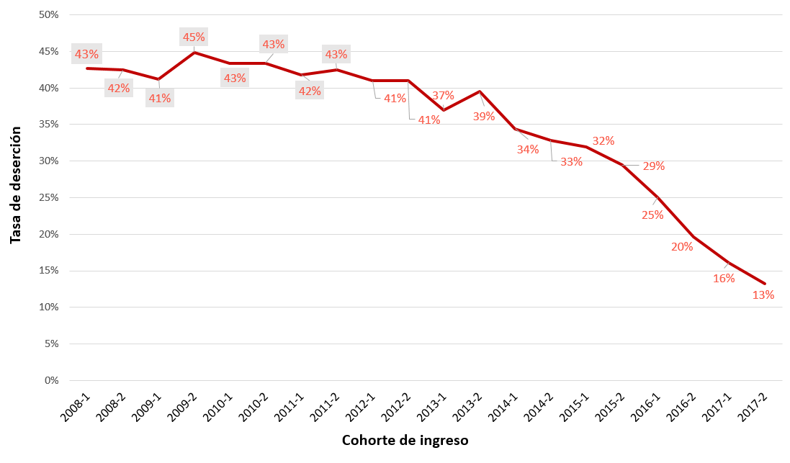
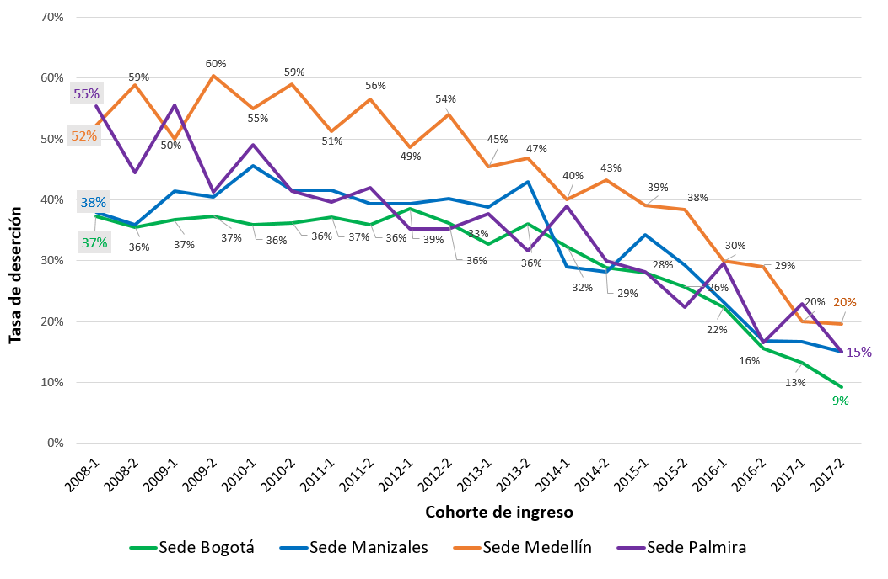
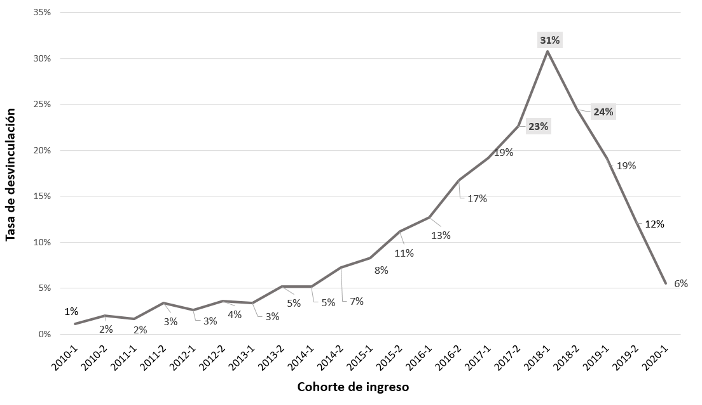

```{r setup, include=FALSE}
options(htmltools.dir.version = FALSE,  htmltools.preserve.raw = FALSE)
```

```{r, echo=FALSE, message=FALSE, warning=FALSE, fig.align='center'}
source("R/Funciones_Nuevas.R", encoding = 'UTF-8')
source("R/SaberPRO.R", encoding = 'UTF-8')
source("R/Admision.R")
source("R/Investigación.R", encoding = 'UTF-8')
```


```{r xaringan-panelset, echo=FALSE}
xaringanExtra::use_panelset()
```

```{r xaringan-logo, echo=FALSE}
xaringanExtra::use_logo(
  image_url = "https://raw.githubusercontent.com/estadisticaun/TendenciasCSU/master/Imagenes/LOGOSIMBOLO%20LATERAL.png", width = "115px",
  height = "133px")
```


<!-- ```{r xaringan-logo, echo=FALSE} -->
<!-- xaringanExtra::use_logo( -->
<!--   image_url = "https://www.cemarin.org/wp-content/uploads/2017/09/PNG_LOGOSIMBOLO-CENTRAL-2-COLORES-VERDE-Y-GRIS-02-268x300.png", width = "85px", -->
<!--   height = "103px") -->
<!-- ``` -->


<!-- ```{r xaringan-logo, echo=FALSE} -->
<!--  xaringanExtra::use_logo( -->
<!--    image_url = "https://upload.wikimedia.org/wikipedia/commons/thumb/0/0a/Logotipo_de_la_Universidad_Nacional_de_Colombia.svg/1200px-Logotipo_de_la_Universidad_Nacional_de_Colombia.svg.png", width = "85px", -->
<!-- height = "103px") -->
<!-- ``` -->


<!-- # Objetivo de la presentación -->

<!-- <p align="justify"> Presentar, a través de la disposición de las principales tendencias estadísticas de la Universidad, una aproximación descriptiva al estado actual institucional de aspectos centrales como la evolución histórica de las principales cifras institucionales; la equidad, la inclusión y el bienestar; la calidad de la educación; los productos, resultados e impactos existentes a nivel institucional, así como el posicionamiento en rankings nacionales e internacionales.  -->

<!-- --- -->

## Consideraciones para el uso adecuado de la presentación

  1.	<p style="font-size:100%  align="justify";> Dar click en la letra <b>H</b> o en el símbolo <b>?</b> para desplegar las distintas <b>opciones de navegación</b> que ofrece la presentación.</p>
  
  2.	<p style="font-size:100%  align="justify";> La opción <b>“Pantalla Completa”</b> presenta <b>problemas</b> en los <b>dispositivos móviles Iphone.</b></p>
  
  3.	<p style="font-size:100%  align="justify";> Si uno o más objetos gráficos presentan algún grado de desconfiguración/deformación, recargar las presentación dando click en la tecla  <b>F5</b> si nos encontramos en un PC o directamente desde la barra del navegador.</p>
  
  4.	<p style="font-size:100%"  align="justify";> La totalidad de gráficos interactivos tienen la opción de ser vistos en <b>pantalla completa</b> (full screen). Para hacer uso de esta opción, ir a la parte baja de cada gráfico o a los íconos ubicados en la parte superior derecha o izquierda de los mismos. Para salir de la opción pantalla completa, dar click en la tecla <b>ESC</b>.</p>
  
  5.	<p style="font-size:100%"  align="justify";> Buena parte de los gráficos contenidos en las distintas diapositivas pueden ser <b>“manipulados”</b> al hacer <b>click</b> en las distintas <b>opciones/etiquetas</b> que los acompañan.</p>

---

## Sistema Estadístico de la UNAL

<p align="justify"> Las estadísticas/indicadores contenidos en esta presentación hacen parte, en una importante proporción, de las cifras contenidas en la página web de [estadísticas](http://estadisticas.unal.edu.co/home/) de la Universidad Nacional de Colombia. En esta página, se puede consultar información oficial, histórica, actual y desagregada por sedes de las principales características asociadas a las poblaciones de aspirantes y admitidos, matriculados, graduados, docentes de carrera y administrativos, principalmente. Invitamos a los interesados a explorar la información allí contenida o a ingresar a los siguientes links (enlaces) en donde se dispone la información existente y disponible a nivel nacional y para cada una de las 9 sedes que conforman la Universidad.


---

# Contenido

.pull-left[

### [1. Tendencias Generales](https://estadisticaun.github.io/TendenciasCSU/#5)
### [2. Equidad, inclusión y bienestar](https://estadisticaun.github.io/TendenciasCSU/#23)
#### [2.1 Equidad de género](https://estadisticaun.github.io/TendenciasCSU/#24)
#### [2.2 Equidad territorial](https://estadisticaun.github.io/TendenciasCSU/#35)
#### [2.3 Inclusión](https://estadisticaun.github.io/TendenciasCSU/#44)
#### [2.4 Bienestar Universitario](https://estadisticaun.github.io/TendenciasCSU/#65)

]

.pull-right[
### [3. Calidad](https://estadisticaun.github.io/TendenciasCSU/#68)
#### [3.1 Docentes](https://estadisticaun.github.io/TendenciasCSU/#69)
#### [3.2  Resultados examen de admisión UNAL](https://estadisticaun.github.io/TendenciasCSU/#71)
#### [3.3Resultados Saber Pro ](https://estadisticaun.github.io/TendenciasCSU/#79)
### [4.Deserción y desvinculación en pregrado](https://estadisticaun.github.io/TendenciasCSU/#97)
### [5. Rankings](https://estadisticaun.github.io/TendenciasCSU/#112)
]

---
class: inverse, center, middle

# 1. Tendencias Generales

<!-- --- -->
<!-- ### Evolución de programas académicos -->

<!-- <iframe width="100%" height="450px" frameborder="0" mozallowfullscreen="true" webkitallowfullscreen="true" allowfullscreen="true" src="https://estadisticaun.github.io/TendenciasCSU/Investigacion/Programas.html"></iframe> -->

<!-- <font size=2><i><b>Fuente:</b> Dirección Nacional de Planeación y Estadística con base en información provista por la Vicerrectoría Académica</i></font>  -->

---
### Evolución de programas académicos por modalidad de formación

<iframe width="100%" height="450px" frameborder="0" mozallowfullscreen="true" webkitallowfullscreen="true" allowfullscreen="true" src="https://estadisticaun.github.io/TendenciasCSU/Investigacion/Modalidad.html"></iframe>

<font size=2><i><b>Fuente:</b> Dirección Nacional de Planeación y Estadística con base en información provista por la Vicerrectoría Académica</i></font> 

---
### Evolución de programas académicos de postgrado

<iframe width="100%" height="450px" frameborder="0" mozallowfullscreen="true" webkitallowfullscreen="true" allowfullscreen="true" src="https://estadisticaun.github.io/TendenciasCSU/Investigacion/Postgrado.html"></iframe>

<font size=2><i><b>Fuente:</b> Dirección Nacional de Planeación y Estadística con base en información provista por la Vicerrectoría Académica</i></font> 

<!-- --- -->
<!-- ### Evolución de Aspirantes -->

<!-- <iframe width="100%" height="450px" frameborder="0" mozallowfullscreen="true" webkitallowfullscreen="true" allowfullscreen="true" src="https://estadisticaun.github.io/G_AspAdm/Nal/Aspirantes/Serie.html"></iframe> -->

<!-- <font size=2><i><b>Fuente:</b> Dirección Nacional de Planeación y Estadística con base en información provista por la Dirección Nacional Admisiones</i></font>  -->

---
### Evolución de Aspirantes - nivel de formación

<iframe width="100%" height="450px" frameborder="0" mozallowfullscreen="true" webkitallowfullscreen="true" allowfullscreen="true" src="https://estadisticaun.github.io/G_AspAdm/Nal/Aspirantes/S_nivel.html"></iframe>

<font size=2><i><b>Fuente:</b> Dirección Nacional de Planeación y Estadística con base en información provista por la Dirección Nacional Admisiones</i></font>

<!-- --- -->
<!-- ### Evolución de Admitidos -->

<!-- <iframe width="100%" height="450px" frameborder="0" mozallowfullscreen="true" webkitallowfullscreen="true" allowfullscreen="true" src="https://estadisticaun.github.io/G_AspAdm/Nal/Admitidos/Serie.html"></iframe> -->

<!-- <font size=2><i><b>Fuente:</b> Dirección Nacional de Planeación y Estadística con base en información provista por la Dirección Nacional Admisiones</i></font>  -->
<!-- --- -->
<!-- ### Evolución de Admitidos - nivel de formación -->

<!-- <iframe width="100%" height="450px" frameborder="0" mozallowfullscreen="true" webkitallowfullscreen="true" allowfullscreen="true" src="https://estadisticaun.github.io/G_AspAdm/Nal/Admitidos/S_nivel.html"></iframe> -->

<!-- <font size=2><i><b>Fuente:</b> Dirección Nacional de Planeación y Estadística con base en información provista por la Dirección Nacional Admisiones</i></font> -->

<!-- --- -->
<!-- ### Evolución de matriculados -->

<!-- <iframe width="100%" height="430px" frameborder="0" mozallowfullscreen="true" webkitallowfullscreen="true" allowfullscreen="true" src="https://estadisticaun.github.io/G_Matriculados/Nal/Matriculados/Serie.html"></iframe> -->

<!-- <font size=1 color="red" align="justify"><b>NOTA:</b> El decrecimiento significativo observado en el total de matriculados en el periodo 2020-1 se debe a la anormalidad académica presentada en la Sede Medellín de la Universidad. En esta sede, durante el periodo 2020-1, los estudiantes regulares de pregrado se encontraban culminando el segundo semestre del año 2019.</font> -->
<!-- <br> -->
<!-- <font size=1><i><b>Fuente:</b> Dirección Nacional de Planeación y Estadística con base en información provista por la Dirección Nacional de Información Académica</i></font> -->

---
### Evolución de matriculados - nivel de formación

<iframe width="100%" height="430px" frameborder="0" mozallowfullscreen="true" webkitallowfullscreen="true" allowfullscreen="true" src="https://estadisticaun.github.io/G_Matriculados/Nal/Matriculados/S_nivel.html"></iframe>

<font size=1 color="red" align="justify"><b>NOTA:</b> El decrecimiento significativo observado en el total de matriculados en el periodo 2020-1 se debe a la anormalidad académica presentada en la Sede Medellín de la Universidad. En esta sede, durante el periodo 2020-1, los estudiantes regulares de pregrado se encontraban culminando el segundo semestre del año 2019.</font>
<br>
<font size=1><i><b>Fuente:</b> Dirección Nacional de Planeación y Estadística con base en información provista por la Dirección Nacional de Información Académica</i></font>


<!-- --- -->
<!-- ### Evolución de Graduados -->

<!-- <iframe width="100%" height="450px" frameborder="0" mozallowfullscreen="true" webkitallowfullscreen="true" allowfullscreen="true" src="https://estadisticaun.github.io/G_Graduados/Nal/Graduados/Serie.html"></iframe> -->

<!-- <font size=2><i><b>Fuente:</b> Dirección Nacional de Planeación y Estadística con base en información provista por la Secretaría General</i></font> -->


---
### Evolución de Graduados - nivel de formación

<iframe width="100%" height="450px" frameborder="0" mozallowfullscreen="true" webkitallowfullscreen="true" allowfullscreen="true" src="https://estadisticaun.github.io/G_Graduados/Nal/Graduados/S_nivel.html"></iframe>

<font size=2><i><b>Fuente:</b> Dirección Nacional de Planeación y Estadística con base en información provista por la Secretaría General</i></font>

---
### Evolución Docentes de Carrera

<iframe width="100%" height="450px" frameborder="0" mozallowfullscreen="true" webkitallowfullscreen="true" allowfullscreen="true" src="https://estadisticaun.github.io/G_Docentes/Nal/Carrera/Serie.html"></iframe>

<font size=2><i><b>Fuente:</b> Dirección Nacional de Planeación y Estadística con base en información provista por la Dirección Nacional de Talento Humano</i></font>

---
### Evolución Funcionarios de Carrera

<iframe width="100%" height="450px" frameborder="0" mozallowfullscreen="true" webkitallowfullscreen="true" allowfullscreen="true" src="https://estadisticaun.github.io/G_Administrativos/Nal/Carrera/Serie.html"></iframe>

<font size=2><i><b>Fuente:</b> Dirección Nacional de Planeación y Estadística con base en información provista por la Dirección Nacional de Talento Humano</i></font>

---
## Para tener en cuenta

--

- <p align="justify"> Durante los últimos 26 años el número de programas académicos de la Universidad creció alrededor de un 150%. De 189 programas existentes en el año 1994 se pasó a 469 en el año 2020. Este crecimiento se presentó de manera significativa en los programas de postgrado 214% (117 en 1994 vs 367 en 2020) y en una menor medida en los programas de pregrado 42% (72 en 1994 vs 102 en 2020). El número de programas de doctorado en estos últimos 26 años se multiplicó por 14 (5 vs 69) y el de maestría por 4 (46 vs 169).

--

- <p align="justify"> Durante los últimos 13 años (20081 -20202) hubo un total de 1.531.682 aspirantes a cursar estudios de educación superior en la Universidad. De estos, el 91% (1.388.428) aspiraron a pregrado y el 9% a postgrado (143.254).

--

- <p align="justify"> Durante los últimos 12 años (2008-2020) la cantidad de estudiantes matriculados en la Universidad Nacional aumentó en un 22% (45200 vs 55124). 

--

- <p align="justify"> En la actualidad, el 86% de la matricula corresponde a pregrado y el 14% a posgrado; estas proporciones, en el año 2018, eran de 82% en pregrado y 18% en postgrado.


---
## Para tener en cuenta

--

- <p align="justify"> A pesar del crecimiento observado en la cantidad de estudiantes matriculados en postgrado durante las últimas dos décadas, en los últimos 5 años se ha presentado un importante descenso en la cantidad de matriculados en los niveles de maestría y doctorado. De 6234 matriculados en programas de maestría en el periodo 2016-1 se pasó a 4600 en el periodo 2020-2; así mismo, de 1595 matriculados en programas de doctorado en el periodo 2016-1 se pasó a 997 matriculados en este nivel de formación en el periodo 2020-2.

--

- <p align="justify"> Durante los últimos 12 años (20091 -20202) hubo un total de 105.653 graduados en la Universidad. De estos, el 62% (65.413) se graduó de pregrado y el 38% de postgrado (40.240).

--

- <p align="justify"> Durante los últimos 12.5 años (20082 -20202), la cantidad de docentes de carrera aumentó en un 6% (2940 en 2008-2 vs 3112 en 2020-2). Esto, a pesar del “congelamiento” de la planta de docentes y administrativos.

--

- <p align="justify"> Durante los últimos 12.5 años (20082 -20202), la cantidad de funcionarios de carrera se ha mantenido constante (2872 en 2008-2 vs 2925 en 2020-2). 

---
class: inverse, center, middle

# 2. Equidad, inclusión y bienestar

---
class: inverse, center, middle
## 2.1 Equidad de género


---

#### Evolución distribución cifras poblacionales UNAL por sexo

.panelset[
.panel[.panel-name[Aspirantes]

<iframe width="100%" height="410px" frameborder="0" mozallowfullscreen="true" webkitallowfullscreen="true" allowfullscreen="true" src="https://estadisticaun.github.io/G_AspAdm/Nal/Aspirantes/S_sexo.html"></iframe>

<font size=2><i><b>Fuente:</b> Dirección Nacional de Planeación y Estadística con base en información provista por la Dirección Nacional de Admisiones</i></font> 
]

.panel[.panel-name[Admitidos]

<iframe width="100%" height="410px" frameborder="0" mozallowfullscreen="true" webkitallowfullscreen="true" allowfullscreen="true" src="https://estadisticaun.github.io/G_AspAdm/Nal/Admitidos/S_sexo.html"></iframe>

<font size=2><i><b>Fuente:</b> Dirección Nacional de Planeación y Estadística con base en información provista por la Dirección Nacional de Admisiones</i></font>

]

.panel[.panel-name[Matriculados]

<iframe width="100%" height="370px" frameborder="0" mozallowfullscreen="true" webkitallowfullscreen="true" allowfullscreen="true" src="https://estadisticaun.github.io/G_Matriculados/Nal/Matriculados/S_sexo.html"></iframe>

<font size=1 color="red" align="justify"><b>NOTA:</b> El decrecimiento observado en el total de matriculados en el periodo 2020-1 se debe a la anormalidad académica presentada en la Sede Medellín de la Universidad. En esta sede, durante este periodo, los estudiantes regulares de pregrado se encontraban culminando el segundo semestre del año 2019.</font>
<br>
<font size=1><i><b>Fuente:</b> Dirección Nacional de Planeación y Estadística con base en información provista por la Dirección Nacional de Información Académica</i></font> 

]


.panel[.panel-name[Pregrado]
<iframe width="100%" height="370px" frameborder="0" mozallowfullscreen="true" webkitallowfullscreen="true" allowfullscreen="true" src="https://estadisticaun.github.io/G_Matriculados/Nal/Pregrado/S_sexo.html"></iframe>

<font size=1 color="red" align="justify"><b>NOTA:</b> El decrecimiento observado en el total de matriculados en el periodo 2020-1 se debe a la anormalidad académica presentada en la Sede Medellín de la Universidad. En esta sede, durante este periodo, los estudiantes regulares de pregrado se encontraban culminando el segundo semestre del año 2019.</font>
<br>
<font size=1><i><b>Fuente:</b> Dirección Nacional de Planeación y Estadística con base en información provista por la Dirección Nacional de Información Académica</i></font> 
]

.panel[.panel-name[Postgrado]
<iframe width="100%" height="410px" frameborder="0" mozallowfullscreen="true" webkitallowfullscreen="true" allowfullscreen="true" src="https://estadisticaun.github.io/G_Matriculados/Nal/Postgrado/S_sexo.html"></iframe>

<font size=2><i><b>Fuente:</b> Dirección Nacional de Planeación y Estadística con base en información provista por la Dirección Nacional de Información Académica</i></font> 
]


.panel[.panel-name[Graduados]

<iframe width="100%" height="410px" frameborder="0" mozallowfullscreen="true" webkitallowfullscreen="true" allowfullscreen="true" src="https://estadisticaun.github.io/G_Graduados/Nal/Graduados/S_sexo.html"></iframe>

<font size=2><i><b>Fuente:</b> Dirección Nacional de Planeación y Estadística con base en información provista por la Secretaría General</i></font>

]

.panel[.panel-name[Docentes]

<iframe width="100%" height="410px" frameborder="0" mozallowfullscreen="true" webkitallowfullscreen="true" allowfullscreen="true" src="https://estadisticaun.github.io/G_Docentes/Nal/Carrera/S_sexo.html"></iframe>

<font size=2><i><b>Fuente:</b> Dirección Nacional de Planeación y Estadística con base en información provista por la Dirección Nacional de Talento Humano</i></font>

]

.panel[.panel-name[Investigador]
<iframe width="100%" height="410px" frameborder="0" mozallowfullscreen="true" webkitallowfullscreen="true" allowfullscreen="true" src="https://estadisticaun.github.io/TendenciasCSU/Investigacion/InvSexSerie.html"></iframe>

<font size=2><i><b>Fuente:</b> Dirección Nacional de Planeación y Estadística con base en información provista por la Vicerrectoría de Investigación</i></font> 
]

.panel[.panel-name[Funcionarios]

<iframe width="100%" height="410px" frameborder="0" mozallowfullscreen="true" webkitallowfullscreen="true" allowfullscreen="true" src="https://estadisticaun.github.io/G_Administrativos/Nal/Carrera/S_sexo.html"></iframe>

<font size=2><i><b>Fuente:</b> Dirección Nacional de Planeación y Estadística con base en información provista por la Dirección Nacional de Talento Humano</i></font> 

]

.panel[.panel-name[NNacional]
<iframe width="100%" height="410px" frameborder="0" mozallowfullscreen="true" webkitallowfullscreen="true" allowfullscreen="true" src="https://estadisticaun.github.io/G_Administrativos/NNal/Carrera/S_sexo.html"></iframe>

<font size=2><i><b>Fuente:</b> Dirección Nacional de Planeación y Estadística con base en información provista por la Dirección Nacional de Talento Humano</i></font> 
]
]


<!-- --- -->
<!-- ### Aspirantes -->

<!-- <iframe width="100%" height="450px" frameborder="0" mozallowfullscreen="true" webkitallowfullscreen="true" allowfullscreen="true" src="https://estadisticaun.github.io/G_AspAdm/Nal/Aspirantes/S_sexo.html"></iframe> -->

<!-- <font size=2><i><b>Fuente:</b> Dirección Nacional de Planeación y Estadística con base en información provista por la Dirección Nacional de Talento Humano</i></font>  -->

<!-- --- -->

<!-- ### Admitidos -->

<!-- <iframe width="100%" height="450px" frameborder="0" mozallowfullscreen="true" webkitallowfullscreen="true" allowfullscreen="true" src="https://estadisticaun.github.io/G_AspAdm/Nal/Admitidos/S_sexo.html"></iframe> -->

<!-- <font size=2><i><b>Fuente:</b> Dirección Nacional de Planeación y Estadística con base en información provista por la Dirección Nacional de Talento Humano</i></font> -->

<!-- --- -->
<!-- ### Matriculados -->

<!-- <iframe width="100%" height="450px" frameborder="0" mozallowfullscreen="true" webkitallowfullscreen="true" allowfullscreen="true" src="https://estadisticaun.github.io/G_Matriculados/Nal/Matriculados/S_sexo.html"></iframe> -->

<!-- <font size=2><i><b>Fuente:</b> Dirección Nacional de Planeación y Estadística con base en información provista por la Dirección Nacional de Talento Humano</i></font>  -->


<!-- --- -->
<!-- ### Pregrado -->

<!-- <iframe width="100%" height="450px" frameborder="0" mozallowfullscreen="true" webkitallowfullscreen="true" allowfullscreen="true" src="https://estadisticaun.github.io/G_Matriculados/Nal/Pregrado/S_sexo.html"></iframe> -->

<!-- <font size=2><i><b>Fuente:</b> Dirección Nacional de Planeación y Estadística con base en información provista por la Dirección Nacional de Información Académica</i></font>  -->

<!-- --- -->
<!-- ### Postgrado -->

<!-- <iframe width="100%" height="450px" frameborder="0" mozallowfullscreen="true" webkitallowfullscreen="true" allowfullscreen="true" src="https://estadisticaun.github.io/G_Matriculados/Nal/Postgrado/S_sexo.html"></iframe> -->

<!-- <font size=2><i><b>Fuente:</b> Dirección Nacional de Planeación y Estadística con base en información provista por la Dirección Nacional de Información Académica</i></font>  -->

<!-- --- -->
<!-- ### Graduados -->

<!-- <iframe width="100%" height="450px" frameborder="0" mozallowfullscreen="true" webkitallowfullscreen="true" allowfullscreen="true" src="https://estadisticaun.github.io/G_Graduados/Nal/Graduados/S_sexo.html"></iframe> -->

<!-- <font size=2><i><b>Fuente:</b> Dirección Nacional de Planeación y Estadística con base en información provista por la Dirección Nacional de Talento Humano</i></font>  -->

<!-- --- -->
<!-- ### Docentes de Carrera -->

<!-- <iframe width="100%" height="450px" frameborder="0" mozallowfullscreen="true" webkitallowfullscreen="true" allowfullscreen="true" src="https://estadisticaun.github.io/G_Docentes/Nal/Carrera/S_sexo.html"></iframe> -->

<!-- <font size=2><i><b>Fuente:</b> Dirección Nacional de Planeación y Estadística con base en información provista por la Dirección Nacional de Talento Humano</i></font>  -->


<!-- --- -->
<!-- ### Docentes investigadores -->

<!-- <iframe width="100%" height="450px" frameborder="0" mozallowfullscreen="true" webkitallowfullscreen="true" allowfullscreen="true" src="https://estadisticaun.github.io/TendenciasCSU/Investigacion/InvSexo.html"></iframe> -->

<!-- <font size=2><i><b>Fuente:</b> Dirección Nacional de Planeación y Estadística con base en información provista por la Vicerrectoría de Investigación</i></font>  -->

<!-- --- -->
<!-- ### Funcionarios de carrera -->

<!-- <iframe width="100%" height="450px" frameborder="0" mozallowfullscreen="true" webkitallowfullscreen="true" allowfullscreen="true" src="https://estadisticaun.github.io/G_Administrativos/Nal/Carrera/S_sexo.html"></iframe> -->

<!-- <font size=2><i><b>Fuente:</b> Dirección Nacional de Planeación y Estadística con base en información provista por la Dirección Nacional de Talento Humano</i></font>  -->

<!-- --- -->
<!-- ### Funcionarios Nivel Nacional -->

<!-- <iframe width="100%" height="450px" frameborder="0" mozallowfullscreen="true" webkitallowfullscreen="true" allowfullscreen="true" src="https://estadisticaun.github.io/G_Administrativos/NNal/Carrera/S_sexo.html"></iframe> -->

<!-- <font size=2><i><b>Fuente:</b> Dirección Nacional de Planeación y Estadística con base en información provista por la Dirección Nacional de Talento Humano</i></font>  -->

---
## Para tener en cuenta

--

- <p align="justify"> Históricamente, el 50% de los aspirantes a la Universidad son hombres y el 50% mujeres. No obstante, históricamente la cantidad de hombres admitidos supera entre un 10% y 12% a la de mujeres. Para el periodo 2020-2, el 60% (4567) de los admitidos fueron hombres y el 40% (3088) mujeres.

--

- <p align="justify"> En la actualidad, el 62% (34053) de los estudiantes matriculados en la Universidad son hombres y el 38% mujeres (21071). Esta desigualdad se reduce levemente en la población de matriculados en postgrado en donde el 58% (4542) son hombres y el 42% (3303) mujeres.

--

- <p align="justify"> El 61% (2307) de los estudiantes graduados de la Universidad son hombres y el 39% (1506) mujeres. Aunque hace 10 años la diferencia era menor entre hombres y mujeres graduadas, durante los últimos años esta se ha venido ampliando en favor de los hombres (56% vs 44% en 2009 - 61% vs 39% en 2020).

---
## Para tener en cuenta

--

- <p align="justify"> La población de la Universidad Nacional de Colombia que presenta una mayor desigualdad entre hombres y mujeres es la de Docentes de Carrera. Del total de docentes de carrera, el 70% (2178) son hombres y el 30% (934) mujeres.

--

- <p align="justify"> La desigualdad observada entre hombres y mujeres en la planta docente es equivalente a la observada en los docentes clasificados como investigadores en Minciencias. Para el año 2020, de los 1192 docentes investigadores que tenía la Universidad, el 69% (827) son hombres y el 31% mujeres (365).

--

- <p align="justify"> La población de la Universidad Nacional de Colombia que presenta una menor desigualdad entre hombres y mujeres es la de Funcionarios Administrativos. En esta población, el 49% (1427) son hombres y el 51% (1498) mujeres.

--

- <p align="justify"> El 63% (230) de los funcionarios administrativos que conforman el Nivel Nacional son mujeres y el 37% (133) hombres.


---
class: inverse, center, middle
## 2.2 Equidad territorial

---

### Matriculados por sedes

<iframe width="100%" height="430px" frameborder="0" mozallowfullscreen="true" webkitallowfullscreen="true" allowfullscreen="true" src="https://estadisticaun.github.io/G_Matriculados/Nal/Matriculados/S_sede.html"></iframe>

<font size=1 color="red" align="justify"><b>NOTA:</b> El decrecimiento significativo observado en el total de matriculados en la Sede Medellín durante el periodo 2020-1 se debe a que, en este periodo, los estudiantes regulares de pregrado se encontraban culminando el segundo semestre del año 2019.</font>
<br>
<font size=1><i><b>Fuente:</b> Dirección Nacional de Planeación y Estadística con base en información provista por la Dirección Nacional de Información Académica </i></font>

<!-- --- -->
<!-- ### Matriculados por sedes -->

<!-- <iframe width="100%" height="450px" frameborder="0" mozallowfullscreen="true" webkitallowfullscreen="true" allowfullscreen="true" src="https://estadisticaun.github.io/G_Matriculados/Nal/Matriculados/A_sede.html"></iframe> -->

<!-- <font size=2><i><b>Fuente:</b> Dirección Nacional de Planeación y Estadística con base en información provista por la Dirección Nacional de Información Académica</i></font> -->

---

### Aspirantes por municipios

<iframe width="100%" height="450px" frameborder="0" mozallowfullscreen="true" webkitallowfullscreen="true" allowfullscreen="true" src="https://estadisticaun.github.io/G_AspAdm/Nal/Aspirantes/Nac_col1.html"></iframe>

<font size=2><i><b>Fuente:</b> Dirección Nacional de Planeación y Estadística con base en información provista por la Dirección Nacional de Admisiones. <br>
<b>Disponible en:</b><a href="https://estadisticaun.github.io/G_AspAdm/Nal/Aspirantes/Nac_col1.html">https://estadisticaun.github.io/G_AspAdm/Nal/Aspirantes/Nac_col1.html</a></i></font> 

---

### Matriculados por municipios

<iframe width="100%" height="450px" frameborder="0" mozallowfullscreen="true" webkitallowfullscreen="true" allowfullscreen="true" src="https://estadisticaun.github.io/G_Matriculados/Nal/Matriculados/Nac_col1.html"></iframe>

<font size=2><i><b>Fuente:</b> Dirección Nacional de Planeación y Estadística con base en información provista por la Dirección Nacional de Información Académica. <br>
<b>Disponible en:</b><a href="https://estadisticaun.github.io/G_Matriculados/Nal/Matriculados/Nac_col1.html">https://estadisticaun.github.io/G_Matriculados/Nal/Matriculados/Nac_col1.html</a></i></font> 


---
## Para tener en cuenta

--

- <p align="justify"> La sede Bogotá representa el 58% (31.791) del total de matriculados de la Universidad; la sede Medellín, el 24% (13.109); la sede Manizales, el 11% (5.831) y la sede Palmira el 5% (2.989). Las demás sedes de la Universidad congregan el 2% (1.404) de los matriculados.

--

- <p align="justify"> La Universidad Nacional de Colombia cuenta con matriculados nacidos en el 82% (925 de 1122) de los municipios del país –incluye corregimientos departamentales-.

--

- <p align="justify"> 56 de cada 100 matriculados en la Universidad nació en la ciudad en donde se ubican las sedes andinas (40% (22.156) Bogotá, 9% (4821) Medellín, 5% (2742) Manizales y 2% (893) Palmira)

--

- <p align="justify"> Un hecho llamativo es la cantidad de estudiantes matriculados nacidos en el departamento de Nariño la cual alcanza el 5% (2.717 de 55.124) de la matricula total de la Universidad.


---
class: inverse, center, middle
## 2.3 Inclusión

<!-- --- -->
<!-- ### Aspirantes a pregrado por modalidad de inscripción -->
<!-- <iframe width="100%" height="450px" frameborder="0" mozallowfullscreen="true" webkitallowfullscreen="true" allowfullscreen="true" src="https://estadisticaun.github.io/G_AspAdm/Nal/AspPre/S_modalidad.html"></iframe> -->

<!-- <font size=2><i><b>Fuente:</b> Dirección Nacional de Planeación y Estadística con base en información provista por la Dirección Nacional de Admisiones</i></font> -->
---
### Inscripción y admisión especial en la UNAL

<p align="justify"> En la Universidad Nacional de Colombia existen dos grandes programas de inscripción y admisión especial: **PAES y PEAMA**. Estas modalidades de inscripción y admisión, además de presentar diversas modalidades, pueden diferir en sus condiciones de acceso y permanencia. Por ejemplo, las modalidades de Victimas del Conflicto Armado Interno en Colombia y Mejores Bachilleres del País del programa PAES, difieren en sus condiciones/beneficios respecto de las demás modalidades de este programa. Para conocer las particularidades que definen cada una de las modalidades que conforman estos programas, los invitamos a explorar la sección **“Desagregaciones de la estadística”** de la sesión de [metadatos](http://estadisticas.unal.edu.co/menu-principal/cifras-generales/metadatos/) de la página de [estadísticas oficiales](http://estadisticas.unal.edu.co/home/) de la Universidad o a dar click en el siguiente enlace.
<br>
* [Metadatos Aspirantes a pregrado - cifras oficiales Universidad Nacional de Colombia](https://bit.ly/3khbf5T)


---
### Aspirantes a pregrado por tipo de inscripción
<iframe width="100%" height="450px" frameborder="0" mozallowfullscreen="true" webkitallowfullscreen="true" allowfullscreen="true" src="https://estadisticaun.github.io/G_AspAdm/Nal/AspPre/S_tipo.html"></iframe>

<font size=2><i><b>Fuente:</b> Dirección Nacional de Planeación y Estadística con base en información provista por la Dirección Nacional de Admisiones</i></font>


---
### Aspirantes a pregrado PEAMA

<iframe width="100%" height="450px" frameborder="0" mozallowfullscreen="true" webkitallowfullscreen="true" allowfullscreen="true" src="https://estadisticaun.github.io/G_AspAdm/Nal/AspPre/S_peama.html"></iframe>

<font size=2><i><b>Fuente:</b> Dirección Nacional de Planeación y Estadística con base en información provista por la Dirección Nacional de Admisiones</i></font>


---
### Aspirantes a pregrado PAES

<iframe width="100%" height="450px" frameborder="0" mozallowfullscreen="true" webkitallowfullscreen="true" allowfullscreen="true" src="https://estadisticaun.github.io/G_AspAdm/Nal/AspPre/S_paes.html"></iframe>

<font size=2><i><b>Fuente:</b> Dirección Nacional de Planeación y Estadística con base en información provista por la Dirección Nacional de Admisiones</i></font>


<!-- --- -->
<!-- ### Admitidos a pregrado por modalidad de inscripción -->
<!-- <iframe width="100%" height="450px" frameborder="0" mozallowfullscreen="true" webkitallowfullscreen="true" allowfullscreen="true" src="https://estadisticaun.github.io/G_AspAdm/Nal/AdmPre/S_modalidad.html"></iframe> -->

<!-- <font size=2><i><b>Fuente:</b> Dirección Nacional de Planeación y Estadística con base en información provista por la Dirección Nacional de Admisiones</i></font> -->

---
### Admitidos a pregrado por tipo de inscripción
<iframe width="100%" height="450px" frameborder="0" mozallowfullscreen="true" webkitallowfullscreen="true" allowfullscreen="true" src="https://estadisticaun.github.io/G_AspAdm/Nal/AdmPre/S_tipo.html"></iframe>

<font size=2><i><b>Fuente:</b> Dirección Nacional de Planeación y Estadística con base en información provista por la Dirección Nacional de Admisiones</i></font>


---
### Admitidos a pregrado PEAMA

<iframe width="100%" height="450px" frameborder="0" mozallowfullscreen="true" webkitallowfullscreen="true" allowfullscreen="true" src="https://estadisticaun.github.io/G_AspAdm/Nal/AdmPre/S_peama.html"></iframe>

<font size=2><i><b>Fuente:</b> Dirección Nacional de Planeación y Estadística con base en información provista por la Dirección Nacional de Admisiones</i></font>


---
### Admitidos a pregrado PAES

<iframe width="100%" height="450px" frameborder="0" mozallowfullscreen="true" webkitallowfullscreen="true" allowfullscreen="true" src="https://estadisticaun.github.io/G_AspAdm/Nal/AdmPre/S_paes.html"></iframe>

<font size=2><i><b>Fuente:</b> Dirección Nacional de Planeación y Estadística con base en información provista por la Dirección Nacional de Admisiones</i></font>


<!-- --- -->
<!-- ### Aspirantes a pregrado en situación de discapacidad -->

<!-- <iframe width="100%" height="450px" frameborder="0" mozallowfullscreen="true" webkitallowfullscreen="true" allowfullscreen="true" src="https://estadisticaun.github.io/G_AspAdm/Nal/AspPre/S_discapacidad.html"></iframe> -->

<!-- <font size=2><i><b>Fuente:</b> Dirección Nacional de Planeación y Estadística con base en información provista por la Dirección Nacional de Admisiones</i></font> -->

---
### Admitidos a pregrado en situación de discapacidad

<iframe width="100%" height="450px" frameborder="0" mozallowfullscreen="true" webkitallowfullscreen="true" allowfullscreen="true" src="https://estadisticaun.github.io/G_AspAdm/Nal/AdmPre/S_discapacidad.html"></iframe>

<font size=2><i><b>Fuente:</b> Dirección Nacional de Planeación y Estadística con base en información provista por la Dirección Nacional de Admisiones</i></font>


---
## Para tener en cuenta

--

- <p align="justify"> El número de aspirantes a la Universidad en situación de discapacidad ha aumentado de manera importante durante los últimos años. De 47 aspirantes en el periodo 2011-1 se pasó a 318 en el 2020-2 (visual 164, motriz 63, auditiva 31, psicosocial 31, cognitiva 28 y otras 1). 

--

- <p align="justify"> En el periodo 2020-2, el 9% de los aspirantes en situación de discapacidad fue admitido a la Universidad (29 de 318).

--

- <p align="justify"> Durante los últimos 12 años, la Universidad Nacional de Colombia ha multiplicado por 7 la proporción de aspirantes a través de modalidades especiales de inscripción y admisión. De un 4% (2.181 de 57.178) de aspirantes inscritos en programas de admisión especial (PAES y PEAMA) en el periodo 2008-1 se pasó a un 27% (10.734 de 40.465) de aspirantes en tal condición en el periodo 2020-2.


---
## Para tener en cuenta

--

- <p align="justify"> En concordancia con lo anterior, la Universidad Nacional de Colombia ha multiplicado por 3 la proporción de admitidos a pregrado a través de modalidades especiales de admisión. De un 8% (459 de 5.695) de aspirantes admitidos en programas de admisión especial (PAES y PEAMA) en el periodo 2008-1 se pasó a un 25% (1.485 de 5.839) de aspirantes admitidos en tal condición en el periodo 2020-2.

--

- <p align="justify"> El 67% de los aspirantes a pregrado inscritos mediante las modalidades de admisión especial corresponde al programa PAES y el 33% al programa PEAMA. Una proporción semejante se mantiene en los admitidos.

--

- <p align="justify"> El número de aspirantes y admitidos del programa PAES bajo las modalidades de Víctimas del Conflicto Armado Interno en Colombia y Comunidades Indígenas ha crecido de manera importante durante de los últimos 12 años. Por ejemplo, de 4 aspirantes pertenecientes al programa de Víctimas en el periodo 2013-2 se pasó a 8.481 aspirantes en el periodo 2019-1 y 4.416 en el periodo 2020-2. ¿Cómo enfrentar estos crecimientos?

---
## Para tener en cuenta


--

- <p align="justify"> El número de aspirantes y admitidos a pregrado provenientes de los mejores bachilleres del país y de municipios pobres ha decrecido durante los últimos años.

--

- <p align="justify"> El número de aspirantes y admitidos a pregrado pertenecientes al programa PEAMA ha crecido de manera importante durante los últimos años. De manera especial, el número de aspirantes y admitidos a través de los programas PEAMA – Orinoquía y PEAMA – Tumaco ha aumentado de manera importante en los últimos años.

--

- <p align="justify"> El número de aspirantes a las sedes Orinoquía (PEAMA – Orinoquía) y Tumaco (PEAMA - Tumaco) supera de manera importante el número de aspirantes de la sede Palmira y se acerca al de la Sede Manizales.


---
class: inverse, center, middle
## 2.4 Bienestar Universitario

---
### Beneficiarios áreas de Bienestar Universitario

<iframe width="100%" height="490px" frameborder="0" mozallowfullscreen="true" webkitallowfullscreen="true" allowfullscreen="true" src="https://estadisticaun.github.io/TendenciasCSU/Investigacion/Bienestar.html"></iframe>

<font size=2><i><b>Fuente:</b> Dirección Nacional de Planeación y Estadística con base en información provista por la Dirección Nacional de Bienestar Universitario</i></font>

---
### Beneficiarios programas área de Gestión y Fomento Socioeconómica 

<iframe width="100%" height="490px" frameborder="0" mozallowfullscreen="true" webkitallowfullscreen="true" allowfullscreen="true" src="https://estadisticaun.github.io/TendenciasCSU/Investigacion/Economica.html"></iframe>

<font size=2><i><b>Fuente:</b> Dirección Nacional de Planeación y Estadística con base en información provista por la Dirección Nacional de Bienestar Universitario</i></font>

---
class: inverse, center, middle

# 3. Calidad


---
class: inverse, center, middle

## 3.1 Docentes

---
### Máxima Formación - Docentes de Carrera

<iframe width="100%" height="450px" frameborder="0" mozallowfullscreen="true" webkitallowfullscreen="true" allowfullscreen="true" src="https://estadisticaun.github.io/G_Docentes/Nal/Carrera/S_formacion.html"></iframe>

<font size=2><i><b>Fuente:</b> Dirección Nacional de Planeación y Estadística con base en información provista por la Dirección Nacional de Talento Humano</i></font>

---
class: inverse, center, middle

## 3.2 Resultados examen de admisión UNAL

---
#### Resultados examen de admisión <FONT COLOR="red">aspirantes</FONT> a la UNAL

.panelset[

.panel[.panel-name[Distribución]

```{r, echo=FALSE, message=FALSE, warning=FALSE, fig.align='left'}
hc_size(Pun_Asp_global, height= 420)
```

<font size=1><i><b>Fuente:</b> Dirección Nacional de Planeación y Estadística con base en información provista por la Dirección Nacional Admisiones</i></font>
]

.panel[.panel-name[Sedes]

```{r, echo=FALSE, message=FALSE, warning=FALSE, fig.align='left', out.height='415'}
hc_size(Pun_Asp_sedes, height= 420)
```

<font size=1><i><b>Fuente:</b> Dirección Nacional de Planeación y Estadística con base en información provista por la Dirección Nacional Admisiones</i></font>
]

.panel[.panel-name[Sexo]

```{r, echo=FALSE, message=FALSE, warning=FALSE, fig.align='left', ,out.height='415'}
hc_size(Pun_Asp_sexo, height= 420)
```

<font size=1><i><b>Fuente:</b> Dirección Nacional de Planeación y Estadística con base en información provista por la Dirección Nacional Admisiones</i></font>
]

.panel[.panel-name[M. inscripción]

```{r, echo=FALSE, message=FALSE, warning=FALSE, fig.align='left', ,out.height='415'}
hc_size(Pun_Asp_tinscrip, height= 420)
```

<font size=1><i><b>Fuente:</b> Dirección Nacional de Planeación y Estadística con base en información provista por la Dirección Nacional Admisiones</i></font>
]

.panel[.panel-name[PAES]

```{r, echo=FALSE, message=FALSE, warning=FALSE, fig.align='left', ,out.height='415'}
hc_size(Pun_Asp_paes, height= 420)
```

<font size=1><i><b>Fuente:</b> Dirección Nacional de Planeación y Estadística con base en información provista por la Dirección Nacional Admisiones</i></font>
]

.panel[.panel-name[Estrato]

```{r, echo=FALSE, message=FALSE, warning=FALSE, fig.align='left', ,out.height='415'}
hc_size(Pun_Asp_estrato, height= 420)
```

<font size=1><i><b>Fuente:</b> Dirección Nacional de Planeación y Estadística con base en información provista por la Dirección Nacional Admisiones</i></font>
]
]

---
#### Resultados examen de admisión <FONT COLOR="red">admitidos</FONT> a la UNAL

.panelset[

.panel[.panel-name[Distribución]

```{r, echo=FALSE, message=FALSE, warning=FALSE, fig.align='left'}
hc_size(Pun_Adm_global, height= 420)
```

<font size=1><i><b>Fuente:</b> Dirección Nacional de Planeación y Estadística con base en información provista por la Dirección Nacional Admisiones</i></font>
]

.panel[.panel-name[Sedes]

```{r, echo=FALSE, message=FALSE, warning=FALSE, fig.align='left', out.height='415'}
hc_size(Pun_Adm_sedes, height= 420)
```

<font size=1><i><b>Fuente:</b> Dirección Nacional de Planeación y Estadística con base en información provista por la Dirección Nacional Admisiones</i></font>
]

.panel[.panel-name[Sexo]

```{r, echo=FALSE, message=FALSE, warning=FALSE, fig.align='left', ,out.height='415'}
hc_size(Pun_Adm_sexo, height= 420)
```

<font size=1><i><b>Fuente:</b> Dirección Nacional de Planeación y Estadística con base en información provista por la Dirección Nacional Admisiones</i></font>
]

.panel[.panel-name[M. inscripción]

```{r, echo=FALSE, message=FALSE, warning=FALSE, fig.align='left', ,out.height='415'}
hc_size(Pun_Adm_tinscrip, height= 420)
```

<font size=1><i><b>Fuente:</b> Dirección Nacional de Planeación y Estadística con base en información provista por la Dirección Nacional Admisiones</i></font>
]

.panel[.panel-name[PAES]

```{r, echo=FALSE, message=FALSE, warning=FALSE, fig.align='left', ,out.height='415'}
hc_size(Pun_Adm_paes, height= 420)
```

<font size=1><i><b>Fuente:</b> Dirección Nacional de Planeación y Estadística con base en información provista por la Dirección Nacional Admisiones</i></font>
]

.panel[.panel-name[Estrato]

```{r, echo=FALSE, message=FALSE, warning=FALSE, fig.align='left', ,out.height='415'}
hc_size(Pun_Adm_estrato, height= 420)
```

<font size=1><i><b>Fuente:</b> Dirección Nacional de Planeación y Estadística con base en información provista por la Dirección Nacional Admisiones</i></font>
]
]

---
class: inverse, center, middle

## 3.3 Resultados pruebas Saber Pro 2019

---
### Cantidad de evaluados pruebas Saber Pro 2019

<p align="justify"> Los resultados que se presentan a continuación se basan en la prueba Saber Pro aplicada por el Instituto Colombiano Para la Evaluación de la Educación ICFES en el año 2019. A continuación, se presenta el número de evaluados en este año a nivel nacional y en cada una de las sedes de la Universidad.

```{r, echo=FALSE, message=FALSE}
Saber <- tibble(`Población` = c("País", "UNAL", "Sede Bogotá", "Sede                                        Medellín", "Sede Manizales", "Sede Palmira", "Sede Orinoquía", "Sede                                          Amazonía", "Sede Caribe"),
                `Total evaluados` = c(260756, 5803, 3441, 1274, 646,
                                      335, 69, 47, 8))
knitr::kable(Saber, col.names = gsub("[.]", " ", names(Saber)))
```

---
#### Resultados <FONT COLOR="red">País</FONT> Saber Pro 2019

.panelset[

.panel[.panel-name[País]

```{r, echo=FALSE, message=FALSE, warning=FALSE, fig.align='left', ,out.height='415'}
Saber_Global_Pais
```

<font size=1><i><b>Fuente:</b> Dirección Nacional de Planeación y Estadística con base en información provista por el Instituto Colombiano para la Evaluación de la Educación - ICFES. 
<b>Disponible en: </b><a href="https://estadisticaun.github.io/TendenciasCSU/SaberPro/GeneralPais.html">https://estadisticaun.github.io/TendenciasCSU/SaberPro/GeneralPais.html</a></i></font> 

]


.panel[.panel-name[UNAL]

```{r, echo=FALSE, message=FALSE, warning=FALSE, fig.align='center', ,out.height='415'}
Saber_Global_Unal
```

<font size=1><i><b>Fuente:</b> Dirección Nacional de Planeación y Estadística con base en información provista por el Instituto Colombiano para la Evaluación de la Educación - ICFES.
<b>Disponible en: </b><a href="https://estadisticaun.github.io/TendenciasCSU/SaberPro/GeneralPais.html">https://estadisticaun.github.io/TendenciasCSU/SaberPro/GeneralPais.html</a></i></font> 

]

.panel[.panel-name[G2]

```{r, echo=FALSE, message=FALSE, warning=FALSE, fig.align='center', ,out.height='415'}
Saber_Global_G2
```

<font size=1><i><b>Fuente:</b> Dirección Nacional de Planeación y Estadística con base en información provista por el Instituto Colombiano para la Evaluación de la Educación - ICFES. 
<b>Disponible en: </b><a href="https://estadisticaun.github.io/TendenciasCSU/SaberPro/Grupo2.html">https://estadisticaun.github.io/TendenciasCSU/SaberPro/Grupo2.html</a></i></font> 

]

.panel[.panel-name[G3]

```{r, echo=FALSE, message=FALSE, warning=FALSE, fig.align='center', ,out.height='415'}
Saber_Global_G3
```

<font size=1><i><b>Fuente:</b> Dirección Nacional de Planeación y Estadística con base en información provista por el Instituto Colombiano para la Evaluación de la Educación - ICFES. 
<b>Disponible en: </b><a href="https://estadisticaun.github.io/TendenciasCSU/SaberPro/Grupo3.html">https://estadisticaun.github.io/TendenciasCSU/SaberPro/Grupo3.html</a></i></font> 

]


.panel[.panel-name[G12]

```{r, echo=FALSE, message=FALSE, warning=FALSE, fig.align='center',out.height='465'}
library(ggplot2)
library(forcats)
ggplot(data = SBPRO_2019_GEN, aes(y = PUNTAJE_GLOBAL, x = fct_reorder(G12, PUNTAJE_GLOBAL, .fun = median))) + 
  geom_boxplot(outlier.color = "green", fill = "gray") +
  ylim(0, 300) + geom_hline(yintercept = 180, col = "red", size = 1) +
  geom_hline(yintercept = c(0, 300), col = "blue", size = 1, linetype="dashed") +
  ggtitle("Distribución puntajes globales Saber Pro 2019", subtitle = "Principales universidades del país\n")+
  ylab("\n Puntaje Promedio Global Saber PRO")+
  xlab("Universidades")+coord_flip() +
  theme(axis.text.y = element_text(size = 13, face = "bold"),
        axis.text.x = element_text(size = 13, colour = "blue"),
  axis.title = element_text(face="bold", color="black", size=16))
```

<font size=1><i><b>Fuente:</b> Dirección Nacional de Planeación y Estadística con base en información provista por el Instituto Colombiano para la Evaluación de la Educación - ICFES. 

]

.panel[.panel-name[G12]

```{r, echo=FALSE, message=FALSE, warning=FALSE, fig.align='center', ,out.height='415'}
Saber_Global_G12
```

<font size=1><i><b>Fuente:</b> Dirección Nacional de Planeación y Estadística con base en información provista por el Instituto Colombiano para la Evaluación de la Educación - ICFES. 
<b>Disponible en: </b><a href="https://estadisticaun.github.io/TendenciasCSU/SaberPro/Grupo12.html">https://estadisticaun.github.io/TendenciasCSU/SaberPro/Grupo12.html</a></i></font> 

]

.panel[.panel-name[G15]

```{r, echo=FALSE, message=FALSE, warning=FALSE, fig.align='center', ,out.height='415'}
Saber_Global_G15
```

<font size=1><i><b>Fuente:</b> Dirección Nacional de Planeación y Estadística con base en información provista por el Instituto Colombiano para la Evaluación de la Educación - ICFES. 
<b>Disponible en: </b><a href="https://estadisticaun.github.io/TendenciasCSU/SaberPro/Grupo15.html">https://estadisticaun.github.io/TendenciasCSU/SaberPro/Grupo15.html</a></i></font> 

]
]

---
<h4> Resultados <FONT COLOR="red">Universidad Nacional</FONT> - Saber Pro 2019 </h4>

.panelset[
.panel[.panel-name[UNAL]

```{r, echo=FALSE, message=FALSE, warning=FALSE, fig.align='left', ,out.height='370'}
Saber_GlobalZ
```

<font size=1><i><b>Fuente:</b> Dirección Nacional de Planeación y Estadística con base en información provista por el Instituto Colombiano para la Evaluación de la Educación - ICFES.
<b>Disponible en: </b><a href="https://estadisticaun.github.io/TendenciasCSU/SaberPro/Generalz.html">https://estadisticaun.github.io/TendenciasCSU/SaberPro/Generalz.html</a></i></font> 
]

.panel[.panel-name[Sedes]

```{r, echo=FALSE, message=FALSE, warning=FALSE, fig.align='center', ,out.height='370'}
Saber_Sede
```

<font size=1><i><b>Fuente:</b> Dirección Nacional de Planeación y Estadística con base en información provista por el Instituto Colombiano para la Evaluación de la Educación - ICFES.
<b>Disponible en: </b><a href="https://estadisticaun.github.io/TendenciasCSU/SaberPro/Sede.html">https://estadisticaun.github.io/TendenciasCSU/SaberPro/Sede.html</a></i></font> 
]

.panel[.panel-name[Sexo]

```{r, echo=FALSE, message=FALSE, warning=FALSE, fig.align='center', ,out.height='370'}
Saber_Sexo
```

<font size=1><i><b>Fuente:</b> Dirección Nacional de Planeación y Estadística con base en información provista por el Instituto Colombiano para la Evaluación de la Educación - ICFES.
<b>Disponible en: </b><a href="https://estadisticaun.github.io/TendenciasCSU/SaberPro/Sexo.html">https://estadisticaun.github.io/TendenciasCSU/SaberPro/Sexo.html</a></i></font> 
]


.panel[.panel-name[T. Admisión]

```{r, echo=FALSE, message=FALSE, warning=FALSE, fig.align='center', ,out.height='370'}
Saber_Tipo
```

<font size=1><i><b>Fuente:</b> Dirección Nacional de Planeación y Estadística con base en información provista por el Instituto Colombiano para la Evaluación de la Educación - ICFES.
<b>Disponible en: </b><a href="https://estadisticaun.github.io/TendenciasCSU/SaberPro/Tipo.html">https://estadisticaun.github.io/TendenciasCSU/SaberPro/Tipo.html</a></i></font> 
]

.panel[.panel-name[PAES]

```{r, echo=FALSE, message=FALSE, warning=FALSE, fig.align='center', ,out.height='370'}
Saber_PAES
```

<font size=1><i><b>Fuente:</b> Dirección Nacional de Planeación y Estadística con base en información provista por el Instituto Colombiano para la Evaluación de la Educación - ICFES.
<b>Disponible en: </b><a href="https://estadisticaun.github.io/TendenciasCSU/SaberPro/Paes.html">https://estadisticaun.github.io/TendenciasCSU/SaberPro/Paes.html</a></i></font> 
]

.panel[.panel-name[PEAMA]

```{r, echo=FALSE, message=FALSE, warning=FALSE, fig.align='center', ,out.height='370'}
Saber_PEAMA
```

<font size=1><i><b>Fuente:</b> Dirección Nacional de Planeación y Estadística con base en información provista por el Instituto Colombiano para la Evaluación de la Educación - ICFES.
<b>Disponible en: </b><a href="https://estadisticaun.github.io/TendenciasCSU/SaberPro/Peama.html">https://estadisticaun.github.io/TendenciasCSU/SaberPro/Peama.html</a></i></font> 
]

.panel[.panel-name[PBM]

```{r, echo=FALSE, message=FALSE, warning=FALSE, fig.align='center', ,out.height='370'}
Saber_PBM
```

<font size=1><i><b>Fuente:</b> Dirección Nacional de Planeación y Estadística con base en información provista por el Instituto Colombiano para la Evaluación de la Educación - ICFES.
<b>Disponible en: </b><a href="https://estadisticaun.github.io/TendenciasCSU/SaberPro/Pbm.html">https://estadisticaun.github.io/TendenciasCSU/SaberPro/Pbm.html</a></i></font> 
]

.panel[.panel-name[Estrato]

```{r, echo=FALSE, message=FALSE, warning=FALSE, fig.align='center', ,out.height='370'}
Saber_Estrato
```

<font size=1><i><b>Fuente:</b> Dirección Nacional de Planeación y Estadística con base en información provista por el Instituto Colombiano para la Evaluación de la Educación - ICFES.
<b>Disponible en: </b><a href="https://estadisticaun.github.io/TendenciasCSU/SaberPro/Estrato.html">https://estadisticaun.github.io/TendenciasCSU/SaberPro/Estrato.html</a></i></font> 
]

.panel[.panel-name[Áreas]

```{r, echo=FALSE, message=FALSE, warning=FALSE, fig.align='center', ,out.height='370'}
Saber_Area
```

<font size=1><i><b>Fuente:</b> Dirección Nacional de Planeación y Estadística con base en información provista por el Instituto Colombiano para la Evaluación de la Educación - ICFES.
<b>Disponible en: </b><a href="https://estadisticaun.github.io/TendenciasCSU/SaberPro/Area.html">https://estadisticaun.github.io/TendenciasCSU/SaberPro/Area.html</a></i></font>

]

]


<!-- --- -->

<!-- ### Resultados Generales UNAL - año 2019 -->

<!-- <iframe width="100%" height="450px" frameborder="0" mozallowfullscreen="true" webkitallowfullscreen="true" allowfullscreen="true" src="https://estadisticaun.github.io/TendenciasCSU/SaberPro/General.html"></iframe> -->


<!-- <font size=2><i><b>Fuente:</b> Dirección Nacional de Planeación y Estadística con base en información provista por el Instituto Colombiano para la Evaluación de la Educación - ICFES. <br> -->
<!-- <b>Disponible en: </b><a href="https://estadisticaun.github.io/TendenciasCSU/SaberPro/General.html">https://estadisticaun.github.io/TendenciasCSU/SaberPro/General.html</a></i></font>  -->

<!-- --- -->
<!-- ### Resultados Generales -->

<!-- <iframe width="100%" height="450px" frameborder="0" mozallowfullscreen="true" webkitallowfullscreen="true" allowfullscreen="true" src="https://estadisticaun.github.io/TendenciasCSU/SaberPro/Generalz.html"></iframe> -->


<!-- <font size=2><i><b>Fuente:</b> Dirección Nacional de Planeación y Estadística con base en información provista por el Instituto Colombiano para la Evaluación de la Educación - ICFES. <br> -->
<!-- <b>Disponible en: </b><a href="https://estadisticaun.github.io/TendenciasCSU/SaberPro/Generalz.html">https://estadisticaun.github.io/TendenciasCSU/SaberPro/Generalz.html</a></i></font>  -->

<!-- --- -->
<!-- ### Resultados por sedes -->

<!-- <iframe width="100%" height="450px" frameborder="0" mozallowfullscreen="true" webkitallowfullscreen="true" allowfullscreen="true" src="https://estadisticaun.github.io/TendenciasCSU/SaberPro/Sede.html"></iframe> -->


<!-- <font size=2><i><b>Fuente:</b> Dirección Nacional de Planeación y Estadística con base en información provista por el Instituto Colombiano para la Evaluación de la Educación - ICFES. <br> -->
<!-- <b>Disponible en: </b><a href="https://estadisticaun.github.io/TendenciasCSU/SaberPro/Sede.html">https://estadisticaun.github.io/TendenciasCSU/SaberPro/Sede.html</a></i></font>  -->


<!-- --- -->
<!-- ### Resultados por sexo -->

<!-- <iframe width="100%" height="450px" frameborder="0" mozallowfullscreen="true" webkitallowfullscreen="true" allowfullscreen="true" src="https://estadisticaun.github.io/TendenciasCSU/SaberPro/Sexo.html"></iframe> -->


<!-- <font size=2><i><b>Fuente:</b> Dirección Nacional de Planeación y Estadística con base en información provista por el Instituto Colombiano para la Evaluación de la Educación - ICFES. <br> -->
<!-- <b>Disponible en: </b><a href="https://estadisticaun.github.io/TendenciasCSU/SaberPro/Sexo.html">https://estadisticaun.github.io/TendenciasCSU/SaberPro/Sexo.html</a></i></font>  -->

<!-- --- -->
<!-- ### Resultados por tipo de admisión -->

<!-- <iframe width="100%" height="450px" frameborder="0" mozallowfullscreen="true" webkitallowfullscreen="true" allowfullscreen="true" src="https://estadisticaun.github.io/TendenciasCSU/SaberPro/Tipo.html"></iframe> -->


<!-- <font size=2><i><b>Fuente:</b> Dirección Nacional de Planeación y Estadística con base en información provista por el Instituto Colombiano para la Evaluación de la Educación - ICFES. <br> -->
<!-- <b>Disponible en: </b><a href="https://estadisticaun.github.io/TendenciasCSU/SaberPro/Tipo.html">https://estadisticaun.github.io/TendenciasCSU/SaberPro/Tipo.html</a></i></font>  -->


<!-- --- -->
<!-- ### Resultados programa PAES -->

<!-- <iframe width="100%" height="450px" frameborder="0" mozallowfullscreen="true" webkitallowfullscreen="true" allowfullscreen="true" src="https://estadisticaun.github.io/TendenciasCSU/SaberPro/Paes.html"></iframe> -->


<!-- <font size=2><i><b>Fuente:</b> Dirección Nacional de Planeación y Estadística con base en información provista por el Instituto Colombiano para la Evaluación de la Educación - ICFES. <br> -->
<!-- <b>Disponible en: </b><a href="https://estadisticaun.github.io/TendenciasCSU/SaberPro/Paes.html">https://estadisticaun.github.io/TendenciasCSU/SaberPro/Paes.html</a></i></font>  -->


<!-- --- -->
<!-- ### Resultados programa PEAMA -->

<!-- <iframe width="100%" height="450px" frameborder="0" mozallowfullscreen="true" webkitallowfullscreen="true" allowfullscreen="true" src="https://estadisticaun.github.io/TendenciasCSU/SaberPro/Peama.html"></iframe> -->


<!-- <font size=2><i><b>Fuente:</b> Dirección Nacional de Planeación y Estadística con base en información provista por el Instituto Colombiano para la Evaluación de la Educación - ICFES. <br> -->
<!-- <b>Disponible en: </b><a href="https://estadisticaun.github.io/TendenciasCSU/SaberPro/Peama.html">https://estadisticaun.github.io/TendenciasCSU/SaberPro/Peama.html</a></i></font>  -->


<!-- --- -->
<!-- ### Resultados por Puntaje Básico de Matrícula - PBM -->

<!-- <iframe width="100%" height="450px" frameborder="0" mozallowfullscreen="true" webkitallowfullscreen="true" allowfullscreen="true" src="https://estadisticaun.github.io/TendenciasCSU/SaberPro/Pbm.html"></iframe> -->


<!-- <font size=2><i><b>Fuente:</b> Dirección Nacional de Planeación y Estadística con base en información provista por el Instituto Colombiano para la Evaluación de la Educación - ICFES. <br> -->
<!-- <b>Disponible en: </b><a href="https://estadisticaun.github.io/TendenciasCSU/SaberPro/Pbm.html">https://estadisticaun.github.io/TendenciasCSU/SaberPro/Pbm.html</a></i></font>  -->

<!-- --- -->
<!-- ### Resultados por estrato -->

<!-- <iframe width="100%" height="450px" frameborder="0" mozallowfullscreen="true" webkitallowfullscreen="true" allowfullscreen="true" src="https://estadisticaun.github.io/TendenciasCSU/SaberPro/Estrato.html"></iframe> -->


<!-- <font size=2><i><b>Fuente:</b> Dirección Nacional de Planeación y Estadística con base en información provista por el Instituto Colombiano para la Evaluación de la Educación - ICFES. <br> -->
<!-- <b>Disponible en: </b><a href="https://estadisticaun.github.io/TendenciasCSU/SaberPro/Estrato.html">https://estadisticaun.github.io/TendenciasCSU/SaberPro/Estrato.html</a></i></font>  -->

<!-- --- -->
<!-- ### Resultados por áreas del conocimiento - SNIES -->

<!-- <iframe width="100%" height="450px" frameborder="0" mozallowfullscreen="true" webkitallowfullscreen="true" allowfullscreen="true" src="https://estadisticaun.github.io/TendenciasCSU/SaberPro/Area.html"></iframe> -->


<!-- <font size=2><i><b>Fuente:</b> Dirección Nacional de Planeación y Estadística con base en información provista por el Instituto Colombiano para la Evaluación de la Educación - ICFES. <br> -->
<!-- <b>Disponible en: </b><a href="https://estadisticaun.github.io/TendenciasCSU/SaberPro/Area.html">https://estadisticaun.github.io/TendenciasCSU/SaberPro/Area.html</a></i></font>  -->


---
## Para tener en cuenta

--

- <p align="justify"> La proporción de docentes con doctorado en la Universidad se ha duplicado en los últimos 12 años. De un 27 % (791) de docentes con doctorado en el periodo 2008-2 se pasó a un 55% (1.724) con este título en el periodo 2020-2.

--

- <p align="justify"> El Examen de Calidad Saber Pro evalúa 5 competencias/pruebas transversales: Competencias Ciudadanas, Comunicación Escrita, inglés, Lectura Crítica y Razonamiento Cuantitativo.

--

- <p align="justify"> En una escala de 0 a 300 puntos, el valor promedio de las pruebas genéricas en el examen Saber Pro de las IES del país se ubicó, en el año 2019, en 147 puntos. 

--

- <p align="justify"> El valor promedio en las pruebas genéricas de los estudiantes de la Universidad Nacional de Colombia se ubicó en 177 puntos. La prueba con mejores resultados en la Universidad es la de razonamiento cuantitativo (188 en promedio) y la peor, comunicación escrita (155 en promedio). 

---
## Para tener en cuenta

--

- <p align="justify"> Los resultados promedio obtenidos en la prueba de comunicación escrita por los estudiantes de la Universidad, además de bajo e histórico, se acerca al promedio obtenido por la totalidad de IES que conforman el Sistema de Educación Superior del país (UNAL 155 vs país 144).


--

- <p align="justify"> La Universidad de los Andes supera en promedio, en todas las pruebas genéricas, a la Universidad Nacional de Colombia.

--

- <p align="justify"> La Universidad Nacional de Colombia, entre las principales universidades del país, es la única institución del SUE que se ubica en los primeros lugares –segundo- en los resultados de la prueba Saber Pro. Las Universidades Antioquia, Valle y UIS se ubican en la parte baja entre las 12 principales universidades.

--

- <p align="justify"> Entre las sedes andinas de la Universidad y con excepción de los resultados obtenidos en la prueba de razonamiento cuantitativo, la Sede Bogotá supera a la Sede Medellín, la Sede Medellín a la de Manizales y la Sede Manizales a la Sede Palmira. En la prueba de razonamiento cuantitativo, la sede Medellín supera los resultados obtenidos por la Sede Bogotá e incluso, los obtenidos por la Universidad de los Andes.


---
## Para tener en cuenta

--

- <p align="justify"> Los estudiantes admitidos a través de la Sede Orinoquía superan en promedio los resultados obtenidos por los estudiantes de la Sede Palmira.

--

- <p align="justify"> Los resultados promedio obtenidos por los hombres en la prueba Saber Pro se acerca al promedio obtenido por las mujeres. Los hombres, en promedio, superan a las mujeres en las pruebas de razonamiento cuantitativo e inglés; en contraste, las mujeres superan en promedio a los hombres en las pruebas de lectura crítica y comunicación escrita.

--

- <p align="justify"> Los estudiantes admitidos a través del programa PEAMA presentan los puntajes promedio más bajos en las pruebas genéricas del examen Saber Pro, seguido de los admitidos a través del programa PAES. Los admitidos de manera regular, además de alejarse de manera importante en los resultados promedio obtenidos, presentan los mejores resultados en la Universidad.

---
## Para tener en cuenta

--

- <p align="justify"> Es preocupante los valores promedio obtenidos en las pruebas genéricas del examen Saber Pro por los estudiantes provenientes de comunidades indígenas.

--

- <p align="justify"> De continuarse con la tendencia actual de resultados obtenidos por los estudiantes PAES y PEAMA (admisión especial) y dado su crecimiento en la Universidad a nivel de inscritos, admitidos y matriculados, se estima que los resultados promedio de la Universidad en las pruebas Saber Pro puede decrecer durante los próximos años.

--

- <p align="justify"> Los estudiantes pertenecientes a familias de estratos iguales o superiores al 4 presentan mejores resultados en las pruebas Saber Pro que los estudiantes provenientes de hogares pertenecientes a estratos 1 o 2. Esta misma correspondencia se observa en el Puntaje Básico de Matrícula (PBM). Mayores PBMs, mejores resultados; menores PBMs, peores resultados.

--

- <p align="justify"> Los estudiantes del área de Matemáticas y Ciencias Naturales presentan los mejores promedios en las pruebas Saber Pro. En contraste, los de Agronomía, Veterinaria y Afines, los peores resultados promedio.

---
class: inverse, center, middle

# 4. Deserción y desvinculación en pregrado

---
## Deserción y desvinculación en la UNAL
#### Definiciones generales

##### <u>Deserción en la UNAL</u>

<p align="justify"> Se considera como desertor(a) "definitivo" al estudiante que, tras cumplir el plazo límite para solicitar reingreso (3 años;cf. Artículo 46. [Acuerdo 008 de 2008 del Consejo Superior Universitario](http://www.legal.unal.edu.co/rlunal/home/doc.jsp?d_i=34983)),continúa bloqueado por alguna de las causas de pérdida de la calidad de estudiante (motivos académicos o no académicos). Teniendo en cuenta lo anterior, no es posible calcular la deserción para las cohortes más recientes (2018-1s 2020-1s) en razón a que los estudiantes de estos periodos, aunque se encuentren bloqueados, tienen probabilidades de regresar/reingresar según lo dispuesto en la normatividad institucional. 

##### <u>Deserción por cohortes en la UNAL</u>

<p align="justify"> Corresponde a la cantidad de estudiantes que ingresaron en un periodo académico determinado (cohorte) y que, a la fecha de corte de la información, se encuentran bloqueados "definitivamente" por las diferentes causas de pérdida de la calidad de estudiante (motivos académicos o motivos no académicos).

---
## Deserción y desvinculación en la UNAL
#### Definiciones generales

##### <u>Desvinculación por cohortes en la UNAL</u>

<p align="justify"> Se considera como desvinculado en la UNAL al estudiante admitido en un periodo/cohorte determinado(a) que se encuentra bloqueado (no matriculado) pero que aún no ha cumplido los tiempos definidos en la Universidad para ser considerado un desertor "definitivo" (3 años;cf. Artículo 46. [Acuerdo 008 de 2008 del Consejo Superior Universitario](http://www.legal.unal.edu.co/rlunal/home/doc.jsp?d_i=34983)). Es decir, tiene probabilidad de retornar a la institución y continuar con sus estudios académicos.

---
## ¿Cómo interpretar los resultados de deserción y desvinculación en la UNAL?

<p align="justify">1.	Los resultados de deserción y de desvinculación se presentan por cohortes. En este sentido, cada uno de los valores (periodos) ilustrados en los ejes X de las figuras, representa una cohorte de estudiantes admitidos a la Universidad. El 2008-1 hace referencia al total de estudiantes matriculados por primera vez en dicho periodo (primíparos), el 2012-1 a los admitidos en dicha cohorte y así, sucesivamente. 

<p align="justify">2.	El periodo de corte y de observación de las mediciones, es el 2020-2. Es decir, la totalidad de cohortes de estudiantes admitidos y matriculados en la UNAL (ejes X de las figuras) es analizado en términos de deserción y desvinculaciones en el periodo 2020-2.

<p align="justify">3.	Por ejemplo, en la figura “Evolución tasa de deserción definitiva de pregrado por cohortes en la UNAL” – la diapositiva siguiente-, el 48% de tasa de deserción observada en el periodo 2008-1 debe leerse como: del total de estudiantes admitidos y matriculados por primera vez en la UNAL en el periodo 2008-1, con corte a 2020-2, el 48% de ellos desertó definitivamente. De igual manera, en esta figura se observa que: del total de estudiantes admitidos a la universidad en el periodo/cohorte 2010-2, con corte al año 2020-2, el 43% desertó definitivamente.

---
## ¿Cómo interpretar los resultados de deserción y desvinculación en la UNAL?

<p align="justify">4.	Las tasas de deserción decrecen a medida que nos acercamos al periodo 2017-2 por una razón central: muchos de los estudiantes admitidos en dichas cohortes aún continúan matriculados y, en caso de estar bloqueados, estos se consideran como desvinculados dado que no han alcanzado el tiempo requerido para considerarse como desertores: entre más antiguas sean las cohortes, más precisa serán las mediciones de deserción; entre más recientes, menos precisas por la condición antes planteada. 

<p align="justify">5.	Las desvinculaciones, al igual que la deserción, además de analizarse por cohortes, hacen referencia a aquellos estudiantes que se encuentran por fuera de la Universidad (bloqueados) pero que no han cumplido con el tiempo institucional de espera (3 años) definido para ser considerados desertores. Una vez cumplan dichos plazos, si estos no se reintegran a la institución, empezarán a engrosar las cifras de deserción. 


---
### Evolución tasa de deserción en pregrado, analizada en el 2020-2, <br>por cohortes en la UNAL. 



<font size=1><i><b>Fuente:</b> Dirección Nacional de Planeación y Estadística con base en información provista por la Dirección Nacional de Programas Curriculares de Pregrado</i></font>

---
### Evolución tasa de deserción en pregrado, analizada en el 2020-2, <br> por sedes y cohortes en la UNAL. 


<font size=1><i><b>Fuente:</b> Dirección Nacional de Planeación y Estadística con base en información provista por la Dirección Nacional de Programas Curriculares de Pregrado</i></font>

---
### Evolución tasa de desvinculación en pregrado, analizada en el <br> 2020-2, por cohortes en la UNAL. 



<font size=1><i><b>Fuente:</b> Dirección Nacional de Planeación y Estadística con base en información provista por la Dirección Nacional de Programas Curriculares de Pregrado</i></font>

---
### Evolución tasa de desvinculación en pregrado, analizada en el <br> 2020-2, por sedes y cohortes en la UNAL. 


<font size=1><i><b>Fuente:</b> Dirección Nacional de Planeación y Estadística con base en información provista por la Dirección Nacional de Programas Curriculares de Pregrado</i></font>

---
### Evolución tasa de deserción vs desvinculación en pregrado, <br> analizada en el 2020-2, en la UNAL.


<font size=1><i><b>Fuente:</b> Dirección Nacional de Planeación y Estadística con base en información provista por la Dirección Nacional de Programas Curriculares de Pregrado</i></font>

---
## Para tener en cuenta

--

- <p align="justify"> La tasa de deserción definitiva en pregrado por cohortes en la Universidad Nacional de Colombia se ubica entre un 41% y 45%. Es decir, por cada 100 admitidos a la UNAL, se espera que entre 41 y 45 de ellos deserten. 

--

- <p align="justify"> La Sede Medellín presenta las mayores tasas de deserción en pregrado por cohortes en la UNAl; en contraste, la Sede Bogotá presenta las tasas más bajas de deserción. Las sedes de Manizales y Palmira ubican sus tasas de deserción entre los valores obtenidos por las sedes Bogotá y Medellín.

--

- <p align="justify"> Por cada 100 admitidos a la UNAL se espera que entre 55 y 60 deserten definitivamente si estos fueron admitidos a la sede Medellín; entre 50 y 55 si fueron admitidos a la Sede Palmira; entre 38 y 45 si fueron admitidos a la Sede Manizales y, finalmente, se espera que deserten entre 36 y 37 si fueron admitidos a la Sede Bogotá.

--

- <p align="justify"> La Sede Medellín de la Universidad Nacional de Colombia presenta las mayores tasas de desvinculación por cohortes de la UNAL; la Sede Bogotá, en contraste, presenta las menores tasas de desvinculación por cohortes. Las sedes Palmira y Manizales, durante los últimos periodos/cohortes presentan unas tasas de desvinculación semejantes –o mayores- a las de la Sede Medellín y se alejan del comportamiento de la Sede Bogotá.


---
class: inverse, center, middle

# 5. Rankings

---
### La UNAL en el Ranking QS
##### Indicadores que mide el ranking QS Mundo


<font size=2><i><b>Fuente:</b> Dirección Nacional de Planeación y Estadística</i></font>


---
### La UNAL en el Ranking QS
##### Puntaje total y puesto en el mundo


<font size=2><i><b>Fuente: </b><a href="https://www.topuniversities.com/
">https://www.topuniversities.com/</a></i></font>

---
### La UNAL en el Ranking QS
##### Puesto en el ranking - evolución


<font size=2><i><b>Fuente:</b> Dirección Nacional de Planeación y Estadística</i></font>


---
### La UNAL en el Ranking QS
##### Puntaje total y puesto por indicador en el mundo


<font size=2><i><b>Fuente: </b><a href="https://www.topuniversities.com/
">https://www.topuniversities.com/</a></i></font>


---
### Universidad Nacional (UNAL) vs Universidad de Buenos Aires (UBA) <br> en el ranking QS
##### Puesto en el listado mundial 2020


<font size=1><i><b>Fuente:</b> QS Analytics </i></font>


---
### UNAL vs UBA en el ranking QS
##### Nominaciones en reputación académica 


<font size=1><i><b>Fuente:</b> QS Analytics </i></font>

---
### UNAL vs UBA en el ranking QS
##### Nominaciones en reputación del empleador


<font size=1><i><b>Fuente:</b> QS Analytics </i></font>

---
### UNAL vs UBA en el ranking QS
##### Resultados en investigación


<font size=1><i><b>Fuente:</b> QS Analytics </i></font>

---
### Razón estudiantes por profesor UNAL - ranking QS
##### Puntaje y comparación con varias universidades


<font size=2><i><b>Fuente: </b><a href="https://www.topuniversities.com/
">https://www.topuniversities.com/</a></i></font>


---
### Razón Estudiantes por docentes TCE

```{r, echo=FALSE, message=FALSE, warning=FALSE, fig.align='center', out.height='420'}
DTCE
```


---
### Porcentaje docentes extranjeros en planta UNAL - ranking QS
##### Puntaje y comparación con varias universidades


<font size=2><i><b>Fuente: </b><a href="https://www.topuniversities.com/
">https://www.topuniversities.com/</a></i></font>

---
### Porcentaje estudiantes extranjeros en la UNAL - ranking QS
##### Puntaje y comparación con varias universidades


<font size=2><i><b>Fuente: </b><a href="https://www.topuniversities.com/
">https://www.topuniversities.com/</a></i></font>


---
## Para tener en cuenta

--

- <p align="justify"> En 10 años, la UNAL ascendió 192 puestos, ubicándose dentro del top de las 300 mejores universidades del mundo según el ranking QS, ocupando el puesto 259.

--

- <p align="justify"> La principal fortaleza de la UNAL en los indicadores que mide el ranking, está asociada a las encuestas reputacionales tanto de académicos como de empleadores.

--

- <p align="justify"> Sobresale el posicionamiento en el indicador de Reputación de empleadores, mejorando 95 lugares en su desempeño desde 2013, ubicándose en el listado mundial en el puesto 37, reflejo de la calidad y el prestigio de sus egresados.

--

- <p align="justify"> Así mismo, la reputación académica es un indicador fuerte para la UNAL, ubicándose en el puesto 114 en el mundo, mejorando 44 lugares desde 2013.

--

- <p align="justify"> El gran desafío para la UNAL se presenta en los indicadores de la relación del número de estudiantes por profesor, el número de citas por artículo publicado, el número de profesores extranjeros en planta y el mayor reto está en el número de estudiantes extranjeros matriculados en la oferta de programas. 

---
class: inverse, center, middle

# ¡Muchas gracias!
<br>
## El contenido de esta presentación se encuentra disponible en:<br>
[https://estadisticaun.github.io/TendenciasCSU/index#1](https://estadisticaun.github.io/TendenciasCSU/index#1)
<br>
## Más información en:<br> [http://estadisticas.unal.edu.co/](http://estadisticas.unal.edu.co/home/)

