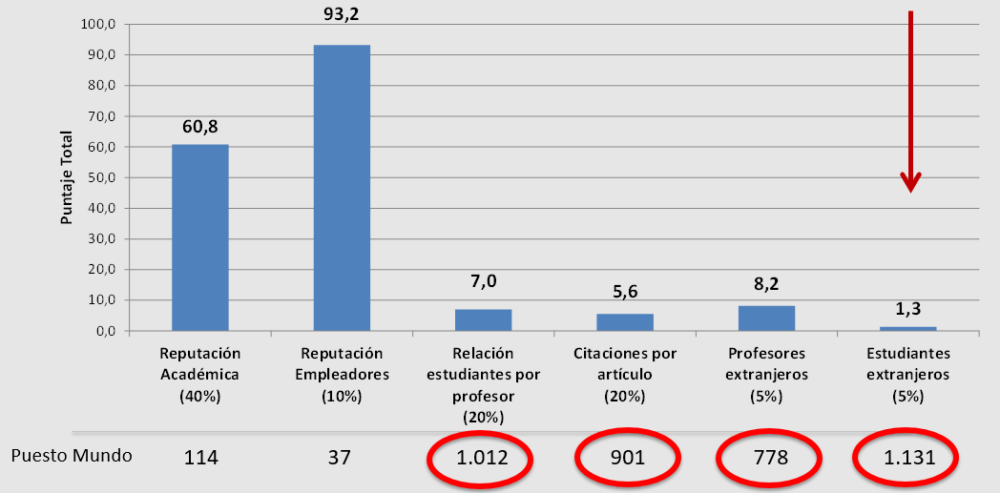

```{r setup, include=FALSE}
options(htmltools.dir.version = FALSE,  htmltools.preserve.raw = FALSE)
```

```{r, echo=FALSE, message=FALSE, warning=FALSE, fig.align='center'}
source("R/Funciones_Nuevas.R", encoding = 'UTF-8')
source("R/SaberPRO.R", encoding = 'UTF-8')
source("R/Investigación.R", encoding = 'UTF-8')
```


```{r xaringan-panelset, echo=FALSE}
xaringanExtra::use_panelset()
```

```{r xaringan-logo, echo=FALSE}
xaringanExtra::use_logo(
  image_url = "https://raw.githubusercontent.com/estadisticaun/TendenciasCSU/master/Imagenes/LOGOSIMBOLO%20LATERAL.png", width = "115px",
  height = "133px")
```


<!-- ```{r xaringan-logo, echo=FALSE} -->
<!-- xaringanExtra::use_logo( -->
<!--   image_url = "https://www.cemarin.org/wp-content/uploads/2017/09/PNG_LOGOSIMBOLO-CENTRAL-2-COLORES-VERDE-Y-GRIS-02-268x300.png", width = "85px", -->
<!--   height = "103px") -->
<!-- ``` -->


<!-- ```{r xaringan-logo, echo=FALSE} -->
<!--  xaringanExtra::use_logo( -->
<!--    image_url = "https://upload.wikimedia.org/wikipedia/commons/thumb/0/0a/Logotipo_de_la_Universidad_Nacional_de_Colombia.svg/1200px-Logotipo_de_la_Universidad_Nacional_de_Colombia.svg.png", width = "85px", -->
<!-- height = "103px") -->
<!-- ``` -->


# Objetivo de la presentación

<p align="justify"> Presentar, a través de la diposición de las principales tendencias estadísticas de la Universidad, una aproximación descriptiva al estado actual institucional de aspectos centrales como la evolución histórica de las principales cifras institucionales; la equidad, la inclusión y el bienestar; la calidad de la educación; los productos, resultados e impactos existentes a nivel institucional; el posicionamiento en rankings nacionales e internacionales; la realidad financiera, así como la ejecución alcanzada a través de la implementación del actual Plan Global de Desarrollo. 

---

## Consideraciones para el uso adecuado de la presentación

  1.	<p style="font-size:100%  align="justify";> Dar click en la letra <b>H</b> o en el símbolo <b>?</b> para desplegar las distintas <b>opciones de navegación</b> que ofrece la presentación.</p>
  
  2.	<p style="font-size:100%  align="justify";> La opción <b>“Pantalla Completa”</b> presenta <b>problemas</b> en los <b>dispositivos móviles Iphone.</b></p>
  
  3.	<p style="font-size:100%  align="justify";> Si uno o más objetos gráficos presentan algún grado de desconfiguración/deformación, recargar las presentación dando click en la tecla  <b>F5</b> si nos encontramos en un PC o directamente desde la barra del navegador.</p>
  
  4.	<p style="font-size:100%"  align="justify";> La totalidad de gráficos interactivos tienen la opción de ser vistos en <b>pantalla completa</b> (full screen). Para hacer uso de esta opción, ir a la parte baja de cada gráfico o a los íconos ubicados en la parte superior derecha o izquierda de los mismos. Para salir de la opción pantalla completa, dar click en la tecla <b>ESC</b>.</p>
  
  5.	<p style="font-size:100%"  align="justify";> Buena parte de los gráficos contenidos en las distintas diapositivas pueden ser <b>“manipulados”</b> al hacer <b>click</b> en las distintas <b>opciones/etiquetas</b> que los acompañan.</p>
  
---
## Sistema Estadístico de la UNAL

<p align="justify"> Las estadísticas/indicadores contenidos en esta presentación hacen parte, en una importante proporción, de las cifras contenidas en la página web de [estadísticas](http://estadisticas.unal.edu.co/home/) de la Universidad Nacional de Colombia. En esta página, se puede consultar información oficial, histórica, actual y desgregada por sedes de las prncipales características asociadas a las poblaciones de aspirantes y admitidos, matriculados, graduados, docentes de carrera y administrativos, principalmente. Invitamos a los interesados a explorar la información allí contenida o a ingresar a los siguientes links (enlaces) en donde se dispone la información existente y disponible a nivel nacional y para cada una de las 9 sedes que conforman la Universidad.


.pull-left[

#### [Cifras Nacionales](http://estadisticas.unal.edu.co/menu-principal/cifras-generales/cifras-generales/)
#### [Sede Bogotá](http://estadisticas.unal.edu.co/menu-principal/cifras-sedes/bogota/)
#### [Sede Medellín](http://estadisticas.unal.edu.co/menu-principal/cifras-sedes/medellin/)
#### [Sede Manizales](http://estadisticas.unal.edu.co/menu-principal/cifras-sedes/manizales/)
#### [Sede Palmira](http://estadisticas.unal.edu.co/menu-principal/cifras-sedes/palmira/)

]

.pull-right[
#### [Sede La Paz (en construcción)](https://estadisticaun.github.io/BoletinLaPaz/)
#### [Sede Orinoquía (en construcción)](https://estadisticaun.github.io/BoletinOrinoquia/)
#### [Sede Amazonía (en construcción)](https://estadisticaun.github.io/BoletinAmazonia/)
#### [Sede Caribe (en construcción)](https://estadisticaun.github.io/BoletinCaribe/)
#### [Sede Tumaco (en construcción)](https://estadisticaun.github.io/BoletinTumaco/)
]

---

# Contenido

.pull-left[

### [1. Tendencias Generales](https://estadisticaun.github.io/TendenciasCSU/#6)
### [2. Equidad, inclusión y bienestar](https://estadisticaun.github.io/TendenciasCSU/#30)
#### [2.1 Equidad de género](https://estadisticaun.github.io/TendenciasCSU/#31)
#### [2.2 Equidad territorial](https://estadisticaun.github.io/TendenciasCSU/#42)
#### [2.3 Inclusión](https://estadisticaun.github.io/TendenciasCSU/#51)
#### [2.4 Bienestar Universitario](https://estadisticaun.github.io/TendenciasCSU/#74)

]

.pull-right[
### [3. Calidad](https://estadisticaun.github.io/TendenciasCSU/#77)
#### [3.1 Docentes](https://estadisticaun.github.io/TendenciasCSU/#78)
#### [3.2 Resultados SaberPRO](https://estadisticaun.github.io/TendenciasCSU/#80)
### [4. Investigación](https://estadisticaun.github.io/TendenciasCSU/#104)
### [5. Rankings](https://estadisticaun.github.io/TendenciasCSU/#124)
]

---
class: inverse, center, middle

# 1. Tendencias Generales

---
### Evolución de programas académicos

<iframe width="100%" height="450px" frameborder="0" mozallowfullscreen="true" webkitallowfullscreen="true" allowfullscreen="true" src="https://estadisticaun.github.io/TendenciasCSU/Investigacion/Programas.html"></iframe>

<font size=2><i><b>Fuente:</b> Dirección Nacional de Planeación y Estadística con base en información provista por la Vicerrectoría Académica</i></font> 

---
### Evolución de programas académicos por modalidad de formación

<iframe width="100%" height="450px" frameborder="0" mozallowfullscreen="true" webkitallowfullscreen="true" allowfullscreen="true" src="https://estadisticaun.github.io/TendenciasCSU/Investigacion/Modalidad.html"></iframe>

<font size=2><i><b>Fuente:</b> Dirección Nacional de Planeación y Estadística con base en información provista por la Vicerrectoría Académica</i></font> 

---
### Evolución de programas académicos de postgrado

<iframe width="100%" height="450px" frameborder="0" mozallowfullscreen="true" webkitallowfullscreen="true" allowfullscreen="true" src="https://estadisticaun.github.io/TendenciasCSU/Investigacion/Postgrado.html"></iframe>

<font size=2><i><b>Fuente:</b> Dirección Nacional de Planeación y Estadística con base en información provista por la Vicerrectoría Académica</i></font> 

---
### Evolución de Aspirantes

<iframe width="100%" height="450px" frameborder="0" mozallowfullscreen="true" webkitallowfullscreen="true" allowfullscreen="true" src="https://estadisticaun.github.io/G_AspAdm/Nal/Aspirantes/Serie.html"></iframe>

<font size=2><i><b>Fuente:</b> Dirección Nacional de Planeación y Estadística con base en información provista por la Dirección Nacional Admisiones</i></font> 

---
### Evolución de Aspirantes - nivel de formación

<iframe width="100%" height="450px" frameborder="0" mozallowfullscreen="true" webkitallowfullscreen="true" allowfullscreen="true" src="https://estadisticaun.github.io/G_AspAdm/Nal/Aspirantes/S_nivel.html"></iframe>

<font size=2><i><b>Fuente:</b> Dirección Nacional de Planeación y Estadística con base en información provista por la Dirección Nacional Admisiones</i></font>

---
### Evolución de Admitidos

<iframe width="100%" height="450px" frameborder="0" mozallowfullscreen="true" webkitallowfullscreen="true" allowfullscreen="true" src="https://estadisticaun.github.io/G_AspAdm/Nal/Admitidos/Serie.html"></iframe>

<font size=2><i><b>Fuente:</b> Dirección Nacional de Planeación y Estadística con base en información provista por la Dirección Nacional Admisiones</i></font> 
---
### Evolución de Admitidos - nivel de formación

<iframe width="100%" height="450px" frameborder="0" mozallowfullscreen="true" webkitallowfullscreen="true" allowfullscreen="true" src="https://estadisticaun.github.io/G_AspAdm/Nal/Admitidos/S_nivel.html"></iframe>

<font size=2><i><b>Fuente:</b> Dirección Nacional de Planeación y Estadística con base en información provista por la Dirección Nacional Admisiones</i></font>

---
### Evolución de matriculados

<iframe width="100%" height="450px" frameborder="0" mozallowfullscreen="true" webkitallowfullscreen="true" allowfullscreen="true" src="https://estadisticaun.github.io/G_Matriculados/Nal/Matriculados/Serie.html"></iframe>

<font size=2><i><b>Fuente:</b> Dirección Nacional de Planeación y Estadística con base en información provista por la Dirección Nacional de Información Académica</i></font>

---
### Evolución de matriculados - nivel de formación

<iframe width="100%" height="450px" frameborder="0" mozallowfullscreen="true" webkitallowfullscreen="true" allowfullscreen="true" src="https://estadisticaun.github.io/G_Matriculados/Nal/Matriculados/S_nivel.html"></iframe>

<font size=2><i><b>Fuente:</b> Dirección Nacional de Planeación y Estadística con base en información provista por la Dirección Nacional de Información Académica</i></font>


---
### Evolución de Graduados

<iframe width="100%" height="450px" frameborder="0" mozallowfullscreen="true" webkitallowfullscreen="true" allowfullscreen="true" src="https://estadisticaun.github.io/G_Graduados/Nal/Graduados/Serie.html"></iframe>

<font size=2><i><b>Fuente:</b> Dirección Nacional de Planeación y Estadística con base en información provista por la Secretaría General</i></font>


---
### Evolución de Graduados - nivel de formación

<iframe width="100%" height="450px" frameborder="0" mozallowfullscreen="true" webkitallowfullscreen="true" allowfullscreen="true" src="https://estadisticaun.github.io/G_Graduados/Nal/Graduados/S_nivel.html"></iframe>

<font size=2><i><b>Fuente:</b> Dirección Nacional de Planeación y Estadística con base en información provista por la Secretaría General</i></font>

---
### Evolución de Docentes de Carrera

<iframe width="100%" height="450px" frameborder="0" mozallowfullscreen="true" webkitallowfullscreen="true" allowfullscreen="true" src="https://estadisticaun.github.io/G_Docentes/Nal/Carrera/Serie.html"></iframe>

<font size=2><i><b>Fuente:</b> Dirección Nacional de Planeación y Estadística con base en información provista por la Dirección Nacional de Talento Humano</i></font>

---
### Evolución de Funcionarios de Carrera

<iframe width="100%" height="450px" frameborder="0" mozallowfullscreen="true" webkitallowfullscreen="true" allowfullscreen="true" src="https://estadisticaun.github.io/G_Administrativos/Nal/Carrera/Serie.html"></iframe>

<font size=2><i><b>Fuente:</b> Dirección Nacional de Planeación y Estadística con base en información provista por la Dirección Nacional de Talento Humano</i></font>

---
## Para tener en cuenta

--

- Durante los últimos 26 años el número de programas académicos de la Universidad creció alrededor de un 150%. De 189 programas existentes en el año 1994 se pasó a 469 en el año 2020. Este crecimiento se presentó de manera significativa en los programas de postgrado 214% (117 en 1994 vs 367 en 2020) y en una menor medida en los programas de pregrado 42% (72 en 1994 vs 102 en 2020). El número de programas de doctorado en estos últimos 26 años se multiplicó por 14 (5 vs 69) y el de maestría por 4 (46 vs 169).

--

- Durante los últimos 13 años (20081 -20202) hubo un total de 1.531.682 aspirantes a cursar estudios de educación superior en la Universidad. De estos, el 91% (1.388.428) aspiraron a pregrado y el 9% a postgrado (143.254).

--

- Durante los últimos 12 años (2008-2020) la cantidad de estudiantes matriculados en la Universidad Nacional aumentó en un 22% (45200 vs 55124). 

--

- En la actualidad, el 86% de la matricula corresponde a pregrado y el 14% a posgrado; estas proporciones, en el año 2018, eran de 82% en pregrado y 18% en postgrado.


---
## Para tener en cuenta

--

- A pesar del crecimiento observado en la cantidad de estudiantes matriculados en postgrado durante las últimas dos décadas, en los últimos 5 años se ha presentado un importante descenso en la cantidad de matriculados en los niveles de maestría y doctorado. De 6234 matriculados en programas de maestría en el periodo 2016-1 se pasó a 4600 en el periodo 2020-2; así mismo, de 1595 matriculados en programas de doctorado en el periodo 2016-1 se pasó a 997 matriculados en este nivel de formación en el periodo 2020-2.

--

- Durante los últimos 12 años (20091 -20202) hubo un total de 105.653 graduados en la Universidad. De estos, el 62% (65.413) se graduó de pregrado y el 38% de postgrado (40.240).

--

- Durante los últimos 12.5 años (20082 -20202), la cantidad de docentes de carrera aumentó en un 6% (2940 en 2008-2 vs 3112 en 2020-2). Esto, a pesar del “congelamiento” de la planta de docentes y administrativos.

--

- Durante los últimos 12.5 años (20082 -20202), la cantidad de funcionarios de carrera se ha mantenido constante (2872 en 2008-2 vs 2925 en 2020-2). 

---
class: inverse, center, middle

# 2. Equidad, inclusión y bienestar

---
class: inverse, center, middle
## 2.1 Equidad de género


---

#### Evolución distribución cifras poblacionales UNAL por sexo

.panelset[
.panel[.panel-name[Aspirantes]

<iframe width="100%" height="410px" frameborder="0" mozallowfullscreen="true" webkitallowfullscreen="true" allowfullscreen="true" src="https://estadisticaun.github.io/G_AspAdm/Nal/Aspirantes/S_sexo.html"></iframe>

<font size=2><i><b>Fuente:</b> Dirección Nacional de Planeación y Estadística con base en información provista por la Dirección Nacional de Admisiones</i></font> 
]

.panel[.panel-name[Admitidos]

<iframe width="100%" height="410px" frameborder="0" mozallowfullscreen="true" webkitallowfullscreen="true" allowfullscreen="true" src="https://estadisticaun.github.io/G_AspAdm/Nal/Admitidos/S_sexo.html"></iframe>

<font size=2><i><b>Fuente:</b> Dirección Nacional de Planeación y Estadística con base en información provista por la Dirección Nacional de Admisiones</i></font>

]

.panel[.panel-name[Matriculados]

<iframe width="100%" height="410px" frameborder="0" mozallowfullscreen="true" webkitallowfullscreen="true" allowfullscreen="true" src="https://estadisticaun.github.io/G_Matriculados/Nal/Matriculados/S_sexo.html"></iframe>

<font size=2><i><b>Fuente:</b> Dirección Nacional de Planeación y Estadística con base en información provista por la Dirección Nacional de Información Académica</i></font> 

]


.panel[.panel-name[Pregrado]
<iframe width="100%" height="410px" frameborder="0" mozallowfullscreen="true" webkitallowfullscreen="true" allowfullscreen="true" src="https://estadisticaun.github.io/G_Matriculados/Nal/Pregrado/S_sexo.html"></iframe>

<font size=2><i><b>Fuente:</b> Dirección Nacional de Planeación y Estadística con base en información provista por la Dirección Nacional de Información Académica</i></font> 
]

.panel[.panel-name[Postgrado]
<iframe width="100%" height="410px" frameborder="0" mozallowfullscreen="true" webkitallowfullscreen="true" allowfullscreen="true" src="https://estadisticaun.github.io/G_Matriculados/Nal/Postgrado/S_sexo.html"></iframe>

<font size=2><i><b>Fuente:</b> Dirección Nacional de Planeación y Estadística con base en información provista por la Dirección Nacional de Información Académica</i></font> 
]


.panel[.panel-name[Graduados]

<iframe width="100%" height="410px" frameborder="0" mozallowfullscreen="true" webkitallowfullscreen="true" allowfullscreen="true" src="https://estadisticaun.github.io/G_Graduados/Nal/Graduados/S_sexo.html"></iframe>

<font size=2><i><b>Fuente:</b> Dirección Nacional de Planeación y Estadística con base en información provista por la Secretaría General</i></font>

]

.panel[.panel-name[Docentes]

<iframe width="100%" height="410px" frameborder="0" mozallowfullscreen="true" webkitallowfullscreen="true" allowfullscreen="true" src="https://estadisticaun.github.io/G_Docentes/Nal/Carrera/S_sexo.html"></iframe>

<font size=2><i><b>Fuente:</b> Dirección Nacional de Planeación y Estadística con base en información provista por la Dirección Nacional de Talento Humano</i></font>

]

.panel[.panel-name[Investigador]
<iframe width="100%" height="410px" frameborder="0" mozallowfullscreen="true" webkitallowfullscreen="true" allowfullscreen="true" src="https://estadisticaun.github.io/TendenciasCSU/Investigacion/InvSexo.html"></iframe>

<font size=2><i><b>Fuente:</b> Dirección Nacional de Planeación y Estadística con base en información provista por la Vicerrectoría de Investigación</i></font> 
]

.panel[.panel-name[Funcionarios]

<iframe width="100%" height="410px" frameborder="0" mozallowfullscreen="true" webkitallowfullscreen="true" allowfullscreen="true" src="https://estadisticaun.github.io/G_Administrativos/Nal/Carrera/S_sexo.html"></iframe>

<font size=2><i><b>Fuente:</b> Dirección Nacional de Planeación y Estadística con base en información provista por la Dirección Nacional de Talento Humano</i></font> 

]

.panel[.panel-name[NNacional]
<iframe width="100%" height="410px" frameborder="0" mozallowfullscreen="true" webkitallowfullscreen="true" allowfullscreen="true" src="https://estadisticaun.github.io/G_Administrativos/NNal/Carrera/S_sexo.html"></iframe>

<font size=2><i><b>Fuente:</b> Dirección Nacional de Planeación y Estadística con base en información provista por la Dirección Nacional de Talento Humano</i></font> 
]
]


<!-- --- -->
<!-- ### Aspirantes -->

<!-- <iframe width="100%" height="450px" frameborder="0" mozallowfullscreen="true" webkitallowfullscreen="true" allowfullscreen="true" src="https://estadisticaun.github.io/G_AspAdm/Nal/Aspirantes/S_sexo.html"></iframe> -->

<!-- <font size=2><i><b>Fuente:</b> Dirección Nacional de Planeación y Estadística con base en información provista por la Dirección Nacional de Talento Humano</i></font>  -->

<!-- --- -->

<!-- ### Admitidos -->

<!-- <iframe width="100%" height="450px" frameborder="0" mozallowfullscreen="true" webkitallowfullscreen="true" allowfullscreen="true" src="https://estadisticaun.github.io/G_AspAdm/Nal/Admitidos/S_sexo.html"></iframe> -->

<!-- <font size=2><i><b>Fuente:</b> Dirección Nacional de Planeación y Estadística con base en información provista por la Dirección Nacional de Talento Humano</i></font> -->

<!-- --- -->
<!-- ### Matriculados -->

<!-- <iframe width="100%" height="450px" frameborder="0" mozallowfullscreen="true" webkitallowfullscreen="true" allowfullscreen="true" src="https://estadisticaun.github.io/G_Matriculados/Nal/Matriculados/S_sexo.html"></iframe> -->

<!-- <font size=2><i><b>Fuente:</b> Dirección Nacional de Planeación y Estadística con base en información provista por la Dirección Nacional de Talento Humano</i></font>  -->


<!-- --- -->
<!-- ### Pregrado -->

<!-- <iframe width="100%" height="450px" frameborder="0" mozallowfullscreen="true" webkitallowfullscreen="true" allowfullscreen="true" src="https://estadisticaun.github.io/G_Matriculados/Nal/Pregrado/S_sexo.html"></iframe> -->

<!-- <font size=2><i><b>Fuente:</b> Dirección Nacional de Planeación y Estadística con base en información provista por la Dirección Nacional de Información Académica</i></font>  -->

<!-- --- -->
<!-- ### Postgrado -->

<!-- <iframe width="100%" height="450px" frameborder="0" mozallowfullscreen="true" webkitallowfullscreen="true" allowfullscreen="true" src="https://estadisticaun.github.io/G_Matriculados/Nal/Postgrado/S_sexo.html"></iframe> -->

<!-- <font size=2><i><b>Fuente:</b> Dirección Nacional de Planeación y Estadística con base en información provista por la Dirección Nacional de Información Académica</i></font>  -->

<!-- --- -->
<!-- ### Graduados -->

<!-- <iframe width="100%" height="450px" frameborder="0" mozallowfullscreen="true" webkitallowfullscreen="true" allowfullscreen="true" src="https://estadisticaun.github.io/G_Graduados/Nal/Graduados/S_sexo.html"></iframe> -->

<!-- <font size=2><i><b>Fuente:</b> Dirección Nacional de Planeación y Estadística con base en información provista por la Dirección Nacional de Talento Humano</i></font>  -->

<!-- --- -->
<!-- ### Docentes de Carrera -->

<!-- <iframe width="100%" height="450px" frameborder="0" mozallowfullscreen="true" webkitallowfullscreen="true" allowfullscreen="true" src="https://estadisticaun.github.io/G_Docentes/Nal/Carrera/S_sexo.html"></iframe> -->

<!-- <font size=2><i><b>Fuente:</b> Dirección Nacional de Planeación y Estadística con base en información provista por la Dirección Nacional de Talento Humano</i></font>  -->


<!-- --- -->
<!-- ### Docentes investigadores -->

<!-- <iframe width="100%" height="450px" frameborder="0" mozallowfullscreen="true" webkitallowfullscreen="true" allowfullscreen="true" src="https://estadisticaun.github.io/TendenciasCSU/Investigacion/InvSexo.html"></iframe> -->

<!-- <font size=2><i><b>Fuente:</b> Dirección Nacional de Planeación y Estadística con base en información provista por la Vicerrectoría de Investigación</i></font>  -->

<!-- --- -->
<!-- ### Funcionarios de carrera -->

<!-- <iframe width="100%" height="450px" frameborder="0" mozallowfullscreen="true" webkitallowfullscreen="true" allowfullscreen="true" src="https://estadisticaun.github.io/G_Administrativos/Nal/Carrera/S_sexo.html"></iframe> -->

<!-- <font size=2><i><b>Fuente:</b> Dirección Nacional de Planeación y Estadística con base en información provista por la Dirección Nacional de Talento Humano</i></font>  -->

<!-- --- -->
<!-- ### Funcionarios Nivel Nacional -->

<!-- <iframe width="100%" height="450px" frameborder="0" mozallowfullscreen="true" webkitallowfullscreen="true" allowfullscreen="true" src="https://estadisticaun.github.io/G_Administrativos/NNal/Carrera/S_sexo.html"></iframe> -->

<!-- <font size=2><i><b>Fuente:</b> Dirección Nacional de Planeación y Estadística con base en información provista por la Dirección Nacional de Talento Humano</i></font>  -->

---
## Para tener en cuenta

--

- La población de la Universidad Nacional de Colombia que presenta una mayor desigualdad entre hombres y mujeres es la de Docentes de Carrera. Del total de docentes de carrera, el 70% (2178) son hombres y el 30% (934) mujeres.

--

- La desigualdad observada entre hombres y mujeres en la planta docente es equivalente a la observada en los docentes clasificados como investigadores en Minciencias. Para el año 2020, de los 1192 docentes investigadores que tenía la Universidad, el 69% (827) son hombres y el 31% mujeres (365).

--

- La población de la Universidad Nacional de Colombia que presenta una menor desigualdad entre hombres y mujeres es la de Funcionarios Administrativos. Del total de funcionarios de carrera, el 49% (1427) son hombres y el 51% (1498) mujeres.

--

- El 63% (230) de los funcionarios que conforman el nivel nacional son mujeres y el 37% (133) hombres.

---
## Para tener en cuenta

--

- Históricamente, el 50% de los aspirantes a la Universidad son hombres y el 50% mujeres. No obstante, históricamente la cantidad de hombres admitidos supera entre un 10% y 12% a la de mujeres. Para el periodo 2020-2, el 60% (4567) de los admitidos fueron hombres y el 60% (3088) mujeres.

--

- En la actualidad, el 62% (34053) de los estudiantes matriculados en la Universidad son hombres y el 38% mujeres (21071). Esta desigualdad se reduce levemente en la población de matriculados en postgrado en donde el 58% (4542) son hombres y el 42% (3303) mujeres.

--

- El 61% (2307) de los estudiantes graduados de la Universidad son hombres y el 39% (1506) mujeres. Aunque hace 10 años la diferencia era menor entre hombres y mujeres graduadas, durante los últimos años esta se ha venido ampliando en favor de los hombres (56% vs 44% en 2009 - 61% vs 39% en 2020).

---
class: inverse, center, middle
## 2.2 Equidad territorial

---

### Matriculados por sedes

<iframe width="100%" height="450px" frameborder="0" mozallowfullscreen="true" webkitallowfullscreen="true" allowfullscreen="true" src="https://estadisticaun.github.io/G_Matriculados/Nal/Matriculados/S_sede.html"></iframe>

<font size=2><i><b>Fuente:</b> Dirección Nacional de Planeación y Estadística con base en información provista por la Dirección Nacional de Información Académica </i></font>

---
### Matriculados por sedes

<iframe width="100%" height="450px" frameborder="0" mozallowfullscreen="true" webkitallowfullscreen="true" allowfullscreen="true" src="https://estadisticaun.github.io/G_Matriculados/Nal/Matriculados/A_sede.html"></iframe>

<font size=2><i><b>Fuente:</b> Dirección Nacional de Planeación y Estadística con base en información provista por la Dirección Nacional de Información Académica</i></font>

---

### Matriculados por municipios

<iframe width="100%" height="450px" frameborder="0" mozallowfullscreen="true" webkitallowfullscreen="true" allowfullscreen="true" src="https://estadisticaun.github.io/G_Matriculados/Nal/Matriculados/Nac_col1.html"></iframe>

<font size=2><i><b>Fuente:</b> Dirección Nacional de Planeación y Estadística con base en información provista por la Dirección Nacional de Talento Humano. <br>
<b>Disponible en:</b><a href="https://estadisticaun.github.io/G_Matriculados/Nal/Matriculados/Nac_col1.html">https://estadisticaun.github.io/G_Matriculados/Nal/Matriculados/Nac_col1.html</a></i></font> 


---
## Para tener en cuenta

--

- La sede Bogotá representa el 58% (31.791) del total de matriculados de la Universidad; la sede Medellín, el 24% (13.109); la sede Manizales, el 11% (5.831) y la sede Palmira el 5% (2.989). Las demás sedes de la Universidad congregan el 2% (1.404) de los matriculados.

--

- La Universidad Nacional de Colombia cuenta con matriculados nacidos en el 82% (925 de 1122) de los municipios del país –incluye corregimientos departamentales-.

--

- 56 de cada 100 matriculados en la Universidad nació en la ciudad en donde se ubican las sedes andinas (40% (22.156) Bogotá, 9% (4821) Medellín, 5% (2742) Manizales y 2% (893) Palmira)

--

- Un hecho llamativo es la cantidad de estudiantes matriculados nacidos en el departamento de Nariño la cual alcanza el 5% (2.717 de 55.124) de la matricula total de la Universidad.


---
class: inverse, center, middle
## 2.3 Inclusión

---
### Aspirantes a pregrado por modalidad de inscripción
<iframe width="100%" height="450px" frameborder="0" mozallowfullscreen="true" webkitallowfullscreen="true" allowfullscreen="true" src="https://estadisticaun.github.io/G_AspAdm/Nal/AspPre/S_modalidad.html"></iframe>

<font size=2><i><b>Fuente:</b> Dirección Nacional de Planeación y Estadística con base en información provista por la Dirección Nacional de Admisiones</i></font>

---
### Aspirantes a pregrado por tipo de inscripción
<iframe width="100%" height="450px" frameborder="0" mozallowfullscreen="true" webkitallowfullscreen="true" allowfullscreen="true" src="https://estadisticaun.github.io/G_AspAdm/Nal/AspPre/S_tipo.html"></iframe>

<font size=2><i><b>Fuente:</b> Dirección Nacional de Planeación y Estadística con base en información provista por la Dirección Nacional de Admisiones</i></font>


---
### Aspirantes a pregrado PEAMA

<iframe width="100%" height="450px" frameborder="0" mozallowfullscreen="true" webkitallowfullscreen="true" allowfullscreen="true" src="https://estadisticaun.github.io/G_AspAdm/Nal/AspPre/S_peama.html"></iframe>

<font size=2><i><b>Fuente:</b> Dirección Nacional de Planeación y Estadística con base en información provista por la Dirección Nacional de Admisiones</i></font>


---
### Aspirantes a pregrado PAES

<iframe width="100%" height="450px" frameborder="0" mozallowfullscreen="true" webkitallowfullscreen="true" allowfullscreen="true" src="https://estadisticaun.github.io/G_AspAdm/Nal/AspPre/S_paes.html"></iframe>

<font size=2><i><b>Fuente:</b> Dirección Nacional de Planeación y Estadística con base en información provista por la Dirección Nacional de Admisiones</i></font>


---
### Admitidos a pregrado por modalidad de inscripción
<iframe width="100%" height="450px" frameborder="0" mozallowfullscreen="true" webkitallowfullscreen="true" allowfullscreen="true" src="https://estadisticaun.github.io/G_AspAdm/Nal/AdmPre/S_modalidad.html"></iframe>

<font size=2><i><b>Fuente:</b> Dirección Nacional de Planeación y Estadística con base en información provista por la Dirección Nacional de Admisiones</i></font>

---
### Admitidos a pregrado por tipo de inscripción
<iframe width="100%" height="450px" frameborder="0" mozallowfullscreen="true" webkitallowfullscreen="true" allowfullscreen="true" src="https://estadisticaun.github.io/G_AspAdm/Nal/AdmPre/S_tipo.html"></iframe>

<font size=2><i><b>Fuente:</b> Dirección Nacional de Planeación y Estadística con base en información provista por la Dirección Nacional de Admisiones</i></font>


---
### Admitidos a pregrado PEAMA

<iframe width="100%" height="450px" frameborder="0" mozallowfullscreen="true" webkitallowfullscreen="true" allowfullscreen="true" src="https://estadisticaun.github.io/G_AspAdm/Nal/AdmPre/S_peama.html"></iframe>

<font size=2><i><b>Fuente:</b> Dirección Nacional de Planeación y Estadística con base en información provista por la Dirección Nacional de Admisiones</i></font>


---
### Admitidos a pregrado PAES

<iframe width="100%" height="450px" frameborder="0" mozallowfullscreen="true" webkitallowfullscreen="true" allowfullscreen="true" src="https://estadisticaun.github.io/G_AspAdm/Nal/AdmPre/S_paes.html"></iframe>

<font size=2><i><b>Fuente:</b> Dirección Nacional de Planeación y Estadística con base en información provista por la Dirección Nacional de Admisiones</i></font>


---
### Aspirantes a pregrado en situación de discapacidad

<iframe width="100%" height="450px" frameborder="0" mozallowfullscreen="true" webkitallowfullscreen="true" allowfullscreen="true" src="https://estadisticaun.github.io/G_AspAdm/Nal/AspPre/S_discapacidad.html"></iframe>

<font size=2><i><b>Fuente:</b> Dirección Nacional de Planeación y Estadística con base en información provista por la Dirección Nacional de Admisiones</i></font>

---
### Admitidos a pregrado en situación de discapacidad

<iframe width="100%" height="450px" frameborder="0" mozallowfullscreen="true" webkitallowfullscreen="true" allowfullscreen="true" src="https://estadisticaun.github.io/G_AspAdm/Nal/AdmPre/S_discapacidad.html"></iframe>

<font size=2><i><b>Fuente:</b> Dirección Nacional de Planeación y Estadística con base en información provista por la Dirección Nacional de Admisiones</i></font>


---
## Para tener en cuenta

--

- El número de aspirantes a la Universidad en situación de discapacidad ha aumentado de manera importante durante los últimos años. De 47 aspirantes en el periodo 2011-1 se pasó a 318 en el 2020-2 (visual 164, motriz 63, auditiva 31, psicosocial 31, cognitiva 28 y otras 1). 

--

- En el periodo 2020-2, el 9% de los aspirantes en situación de discapacidad fue admitido a la Universidad (29 de 318).

--

- Durante los últimos 12 años, la Universidad Nacional de Colombia ha multiplicado por 7 la proporción de aspirantes a través de modalidades especiales de inscripción y admisión. De un 4% (2.181 de 57.178) de aspirantes inscritos en programas de admisión especial (PAES y PEAMA) en el periodo 2008-1 se pasó a un 27% (10.734 de 40.465) de aspirantes en tal condición en el periodo 2020-2.


---
## Para tener en cuenta

--

- En concordancia con lo anterior, la Universidad Nacional de Colombia ha multiplicado por 3 la proporción de admitidos a pregrado a través de modalidades especiales de admisión. De un 8% (459 de 5.695) de aspirantes admitidos en programas de admisión especial (PAES y PEAMA) en el periodo 2008-1 se pasó a un 25% (1.485 de 5.839) de aspirantes admitidos en tal condición en el periodo 2020-2.

--

- El 67% de los aspirantes a pregrado inscritos mediante las modalidades de admisión especial corresponde al programa PAES y el 33% al programa PEAMA. Una proporción semejante se mantiene en los admitidos.

--

- El número de aspirantes y admitidos del programa PAES bajo las modalidades de Victimas del Conflicto Armado Interno en Colombia y Comunidades Indígenas ha crecido de manera importante durante de los últimos 12 años. Por ejemplo, de 4 aspirantes pertenecientes al programa de Victimas en el periodo 2013-2 se pasó a 8.481 aspirantes en el periodo 2019-1 y 4.416 en el periodo 2020-2. ¿Cómo enfrentar estos crecimientos?

---
## Para tener en cuenta


--

- El número de aspirantes y admitidos a pregrado provenientes de los mejores bachilleres del país y de municipios pobres ha decrecido durante los últimos años.

--

- El número de aspirantes y admitidos a pregrado pertenecientes al programa PEAMA ha crecido de manera importante durante los últimos años. De manera especial, el número de aspirantes y admitidos a través de los programas PEAMA – Orinoquía y PEAMA – Tumaco ha aumentado de manera importante en los últimos años.

--

- El número de aspirantes a las sedes Orinoquía (PEAMA – Orinoquía) y Tumaco (PEAMA - Tumaco) supera de manera importante el número de aspirantes de la sede Palmira y se acerca al de la Sede Manizales.


---
class: inverse, center, middle
## 2.4 Bienestar Universitario

---
### Beneficiarios áreas de Bienestar Universitario

<iframe width="100%" height="490px" frameborder="0" mozallowfullscreen="true" webkitallowfullscreen="true" allowfullscreen="true" src="https://estadisticaun.github.io/TendenciasCSU/Investigacion/Bienestar.html"></iframe>

<font size=2><i><b>Fuente:</b> Dirección Nacional de Planeación y Estadística con base en información provista por la Dirección Nacional de Bienestar Universitario</i></font>

---
### Beneficiarios programas área de Gestión y Fomento Socioeconómica 

<iframe width="100%" height="490px" frameborder="0" mozallowfullscreen="true" webkitallowfullscreen="true" allowfullscreen="true" src="https://estadisticaun.github.io/TendenciasCSU/Investigacion/Economica.html"></iframe>

<font size=2><i><b>Fuente:</b> Dirección Nacional de Planeación y Estadística con base en información provista por la Dirección Nacional de Bienestar Universitario</i></font>


---
class: inverse, center, middle

# 3. Calidad


---
class: inverse, center, middle

## 3.1 Docentes

---
### Máxima Formación - Docentes de Carrera

<iframe width="100%" height="450px" frameborder="0" mozallowfullscreen="true" webkitallowfullscreen="true" allowfullscreen="true" src="https://estadisticaun.github.io/G_Docentes/Nal/Carrera/S_formacion.html"></iframe>

<font size=2><i><b>Fuente:</b> Dirección Nacional de Planeación y Estadística con base en información provista por la Dirección Nacional de Talento Humano</i></font>

---
class: inverse, center, middle

## 3.2 Resultados pruebas SaberPRO 2019


---
### Cantidad de evaluados pruebas SaberPRO 2019

<p align="justify"> Los resultados que se presentan a continuación se basan en la prueba SaberPRO aplicada por el Instituto Colombiano Para la Evaluación de la Educación ICFES en el año 2019. A continuación, se presenta el número de evaluados en este año a nivel nacional y en cada una de las sedes de la Universidad. 

```{r, echo=FALSE, message=FALSE}
library(dplyr)
library(knitr)
Saber <- tibble(`Población` = c("País", "UNAL", "Sede Bogotá", "Sede                                        Medellín", "Sede Manizales", "Sede                                         Palmira", "Sede Orinoquía", "Sede                                          Amazonía", "Sede Caribe"),
                `Total evaluados` = c(260756, 5803, 3441, 1274, 646,
                                      335, 69, 47, 8))
knitr::kable(Saber, col.names = gsub("[.]", " ", names(Saber)))
```


---
### Competencias genéricas evaluadas en las pruebas Saber Pro 2019


---
#### Resultados <FONT COLOR="red">País</FONT> SaberPRO 2019

.panelset[

.panel[.panel-name[País]

```{r, echo=FALSE, message=FALSE, warning=FALSE, fig.align='left', ,out.height='415'}
Saber_Global_Pais
```

<font size=1><i><b>Fuente:</b> Dirección Nacional de Planeación y Estadística con base en información provista por el Instituto Colombiano para la Evaluación de la Educación - ICFES. 
<b>Disponible en: </b><a href="https://estadisticaun.github.io/TendenciasCSU/SaberPro/GeneralPais.html">https://estadisticaun.github.io/TendenciasCSU/SaberPro/GeneralPais.html</a></i></font> 

]


.panel[.panel-name[UNAL]

```{r, echo=FALSE, message=FALSE, warning=FALSE, fig.align='center', ,out.height='415'}
Saber_Global_Unal
```

<font size=1><i><b>Fuente:</b> Dirección Nacional de Planeación y Estadística con base en información provista por el Instituto Colombiano para la Evaluación de la Educación - ICFES.
<b>Disponible en: </b><a href="https://estadisticaun.github.io/TendenciasCSU/SaberPro/GeneralPais.html">https://estadisticaun.github.io/TendenciasCSU/SaberPro/GeneralPais.html</a></i></font> 

]

.panel[.panel-name[G2]

```{r, echo=FALSE, message=FALSE, warning=FALSE, fig.align='center', ,out.height='415'}
Saber_Global_G2
```

<font size=1><i><b>Fuente:</b> Dirección Nacional de Planeación y Estadística con base en información provista por el Instituto Colombiano para la Evaluación de la Educación - ICFES. 
<b>Disponible en: </b><a href="https://estadisticaun.github.io/TendenciasCSU/SaberPro/Grupo2.html">https://estadisticaun.github.io/TendenciasCSU/SaberPro/Grupo2.html</a></i></font> 

]


.panel[.panel-name[G12]

```{r, echo=FALSE, message=FALSE, warning=FALSE, fig.align='center',out.height='465'}
library(ggplot2)
library(forcats)
ggplot(data = SBPRO_2019_GEN, aes(y = PUNTAJE_GLOBAL, x = fct_reorder(G12, PUNTAJE_GLOBAL, .fun = median))) + 
  geom_boxplot(outlier.color = "green", fill = "gray") +
  ylim(0, 300) + geom_hline(yintercept = 180, col = "red", size = 1) +
  geom_hline(yintercept = c(0, 300), col = "blue", size = 1, linetype="dashed") +
  ggtitle("Distribución puntajes globales SaberPRO 2019", subtitle = "Principales universidades del país\n")+
  ylab("\n Puntaje Promedio Global Saber PRO")+
  xlab("Universidades")+coord_flip() +
  theme(axis.text.y = element_text(size = 13, face = "bold"),
        axis.text.x = element_text(size = 13, colour = "blue"),
  axis.title = element_text(face="bold", color="black", size=16))
```

<font size=1><i><b>Fuente:</b> Dirección Nacional de Planeación y Estadística con base en información provista por el Instituto Colombiano para la Evaluación de la Educación - ICFES. 

]

.panel[.panel-name[G12]

```{r, echo=FALSE, message=FALSE, warning=FALSE, fig.align='center', ,out.height='415'}
Saber_Global_G12
```

<font size=1><i><b>Fuente:</b> Dirección Nacional de Planeación y Estadística con base en información provista por el Instituto Colombiano para la Evaluación de la Educación - ICFES. 
<b>Disponible en: </b><a href="https://estadisticaun.github.io/TendenciasCSU/SaberPro/Grupo12.html">https://estadisticaun.github.io/TendenciasCSU/SaberPro/Grupo12.html</a></i></font> 

]

.panel[.panel-name[G15]

```{r, echo=FALSE, message=FALSE, warning=FALSE, fig.align='center', ,out.height='415'}
Saber_Global_G15
```

<font size=1><i><b>Fuente:</b> Dirección Nacional de Planeación y Estadística con base en información provista por el Instituto Colombiano para la Evaluación de la Educación - ICFES. 
<b>Disponible en: </b><a href="https://estadisticaun.github.io/TendenciasCSU/SaberPro/Grupo15.html">https://estadisticaun.github.io/TendenciasCSU/SaberPro/Grupo15.html</a></i></font> 

]
]

---
<h4> Resultados <FONT COLOR="red">Universidad Nacional</FONT> - SaberPRO 2019 </h4>

.panelset[
.panel[.panel-name[UNAL]

```{r, echo=FALSE, message=FALSE, warning=FALSE, fig.align='left', ,out.height='370'}
Saber_GlobalZ
```

<font size=1><i><b>Fuente:</b> Dirección Nacional de Planeación y Estadística con base en información provista por el Instituto Colombiano para la Evaluación de la Educación - ICFES.
<b>Disponible en: </b><a href="https://estadisticaun.github.io/TendenciasCSU/SaberPro/Generalz.html">https://estadisticaun.github.io/TendenciasCSU/SaberPro/Generalz.html</a></i></font> 
]

.panel[.panel-name[Sedes]

```{r, echo=FALSE, message=FALSE, warning=FALSE, fig.align='center', ,out.height='370'}
Saber_Sede
```

<font size=1><i><b>Fuente:</b> Dirección Nacional de Planeación y Estadística con base en información provista por el Instituto Colombiano para la Evaluación de la Educación - ICFES.
<b>Disponible en: </b><a href="https://estadisticaun.github.io/TendenciasCSU/SaberPro/Sede.html">https://estadisticaun.github.io/TendenciasCSU/SaberPro/Sede.html</a></i></font> 
]

.panel[.panel-name[Sexo]

```{r, echo=FALSE, message=FALSE, warning=FALSE, fig.align='center', ,out.height='370'}
Saber_Sexo
```

<font size=1><i><b>Fuente:</b> Dirección Nacional de Planeación y Estadística con base en información provista por el Instituto Colombiano para la Evaluación de la Educación - ICFES.
<b>Disponible en: </b><a href="https://estadisticaun.github.io/TendenciasCSU/SaberPro/Sexo.html">https://estadisticaun.github.io/TendenciasCSU/SaberPro/Sexo.html</a></i></font> 
]


.panel[.panel-name[T. Admisión]

```{r, echo=FALSE, message=FALSE, warning=FALSE, fig.align='center', ,out.height='370'}
Saber_Tipo
```

<font size=1><i><b>Fuente:</b> Dirección Nacional de Planeación y Estadística con base en información provista por el Instituto Colombiano para la Evaluación de la Educación - ICFES.
<b>Disponible en: </b><a href="https://estadisticaun.github.io/TendenciasCSU/SaberPro/Tipo.html">https://estadisticaun.github.io/TendenciasCSU/SaberPro/Tipo.html</a></i></font> 
]

.panel[.panel-name[PAES]

```{r, echo=FALSE, message=FALSE, warning=FALSE, fig.align='center', ,out.height='370'}
Saber_PAES
```

<font size=1><i><b>Fuente:</b> Dirección Nacional de Planeación y Estadística con base en información provista por el Instituto Colombiano para la Evaluación de la Educación - ICFES.
<b>Disponible en: </b><a href="https://estadisticaun.github.io/TendenciasCSU/SaberPro/Paes.html">https://estadisticaun.github.io/TendenciasCSU/SaberPro/Paes.html</a></i></font> 
]

.panel[.panel-name[PEAMA]

```{r, echo=FALSE, message=FALSE, warning=FALSE, fig.align='center', ,out.height='370'}
Saber_PEAMA
```

<font size=1><i><b>Fuente:</b> Dirección Nacional de Planeación y Estadística con base en información provista por el Instituto Colombiano para la Evaluación de la Educación - ICFES.
<b>Disponible en: </b><a href="https://estadisticaun.github.io/TendenciasCSU/SaberPro/Peama.html">https://estadisticaun.github.io/TendenciasCSU/SaberPro/Peama.html</a></i></font> 
]

.panel[.panel-name[PBM]

```{r, echo=FALSE, message=FALSE, warning=FALSE, fig.align='center', ,out.height='370'}
Saber_PBM
```

<font size=1><i><b>Fuente:</b> Dirección Nacional de Planeación y Estadística con base en información provista por el Instituto Colombiano para la Evaluación de la Educación - ICFES.
<b>Disponible en: </b><a href="https://estadisticaun.github.io/TendenciasCSU/SaberPro/Pbm.html">https://estadisticaun.github.io/TendenciasCSU/SaberPro/Pbm.html</a></i></font> 
]

.panel[.panel-name[Estrato]

```{r, echo=FALSE, message=FALSE, warning=FALSE, fig.align='center', ,out.height='370'}
Saber_Estrato
```

<font size=1><i><b>Fuente:</b> Dirección Nacional de Planeación y Estadística con base en información provista por el Instituto Colombiano para la Evaluación de la Educación - ICFES.
<b>Disponible en: </b><a href="https://estadisticaun.github.io/TendenciasCSU/SaberPro/Estrato.html">https://estadisticaun.github.io/TendenciasCSU/SaberPro/Estrato.html</a></i></font> 
]

.panel[.panel-name[Áreas]

```{r, echo=FALSE, message=FALSE, warning=FALSE, fig.align='center', ,out.height='370'}
Saber_Area
```

<font size=1><i><b>Fuente:</b> Dirección Nacional de Planeación y Estadística con base en información provista por el Instituto Colombiano para la Evaluación de la Educación - ICFES.
<b>Disponible en: </b><a href="https://estadisticaun.github.io/TendenciasCSU/SaberPro/Area.html">https://estadisticaun.github.io/TendenciasCSU/SaberPro/Area.html</a></i></font>

]

]


<!-- --- -->

<!-- ### Resultados Generales UNAL - año 2019 -->

<!-- <iframe width="100%" height="450px" frameborder="0" mozallowfullscreen="true" webkitallowfullscreen="true" allowfullscreen="true" src="https://estadisticaun.github.io/TendenciasCSU/SaberPro/General.html"></iframe> -->


<!-- <font size=2><i><b>Fuente:</b> Dirección Nacional de Planeación y Estadística con base en información provista por el Instituto Colombiano para la Evaluación de la Educación - ICFES. <br> -->
<!-- <b>Disponible en: </b><a href="https://estadisticaun.github.io/TendenciasCSU/SaberPro/General.html">https://estadisticaun.github.io/TendenciasCSU/SaberPro/General.html</a></i></font>  -->

<!-- --- -->
<!-- ### Resultados Generales -->

<!-- <iframe width="100%" height="450px" frameborder="0" mozallowfullscreen="true" webkitallowfullscreen="true" allowfullscreen="true" src="https://estadisticaun.github.io/TendenciasCSU/SaberPro/Generalz.html"></iframe> -->


<!-- <font size=2><i><b>Fuente:</b> Dirección Nacional de Planeación y Estadística con base en información provista por el Instituto Colombiano para la Evaluación de la Educación - ICFES. <br> -->
<!-- <b>Disponible en: </b><a href="https://estadisticaun.github.io/TendenciasCSU/SaberPro/Generalz.html">https://estadisticaun.github.io/TendenciasCSU/SaberPro/Generalz.html</a></i></font>  -->

<!-- --- -->
<!-- ### Resultados por sedes -->

<!-- <iframe width="100%" height="450px" frameborder="0" mozallowfullscreen="true" webkitallowfullscreen="true" allowfullscreen="true" src="https://estadisticaun.github.io/TendenciasCSU/SaberPro/Sede.html"></iframe> -->


<!-- <font size=2><i><b>Fuente:</b> Dirección Nacional de Planeación y Estadística con base en información provista por el Instituto Colombiano para la Evaluación de la Educación - ICFES. <br> -->
<!-- <b>Disponible en: </b><a href="https://estadisticaun.github.io/TendenciasCSU/SaberPro/Sede.html">https://estadisticaun.github.io/TendenciasCSU/SaberPro/Sede.html</a></i></font>  -->


<!-- --- -->
<!-- ### Resultados por sexo -->

<!-- <iframe width="100%" height="450px" frameborder="0" mozallowfullscreen="true" webkitallowfullscreen="true" allowfullscreen="true" src="https://estadisticaun.github.io/TendenciasCSU/SaberPro/Sexo.html"></iframe> -->


<!-- <font size=2><i><b>Fuente:</b> Dirección Nacional de Planeación y Estadística con base en información provista por el Instituto Colombiano para la Evaluación de la Educación - ICFES. <br> -->
<!-- <b>Disponible en: </b><a href="https://estadisticaun.github.io/TendenciasCSU/SaberPro/Sexo.html">https://estadisticaun.github.io/TendenciasCSU/SaberPro/Sexo.html</a></i></font>  -->

<!-- --- -->
<!-- ### Resultados por tipo de admisión -->

<!-- <iframe width="100%" height="450px" frameborder="0" mozallowfullscreen="true" webkitallowfullscreen="true" allowfullscreen="true" src="https://estadisticaun.github.io/TendenciasCSU/SaberPro/Tipo.html"></iframe> -->


<!-- <font size=2><i><b>Fuente:</b> Dirección Nacional de Planeación y Estadística con base en información provista por el Instituto Colombiano para la Evaluación de la Educación - ICFES. <br> -->
<!-- <b>Disponible en: </b><a href="https://estadisticaun.github.io/TendenciasCSU/SaberPro/Tipo.html">https://estadisticaun.github.io/TendenciasCSU/SaberPro/Tipo.html</a></i></font>  -->


<!-- --- -->
<!-- ### Resultados programa PAES -->

<!-- <iframe width="100%" height="450px" frameborder="0" mozallowfullscreen="true" webkitallowfullscreen="true" allowfullscreen="true" src="https://estadisticaun.github.io/TendenciasCSU/SaberPro/Paes.html"></iframe> -->


<!-- <font size=2><i><b>Fuente:</b> Dirección Nacional de Planeación y Estadística con base en información provista por el Instituto Colombiano para la Evaluación de la Educación - ICFES. <br> -->
<!-- <b>Disponible en: </b><a href="https://estadisticaun.github.io/TendenciasCSU/SaberPro/Paes.html">https://estadisticaun.github.io/TendenciasCSU/SaberPro/Paes.html</a></i></font>  -->


<!-- --- -->
<!-- ### Resultados programa PEAMA -->

<!-- <iframe width="100%" height="450px" frameborder="0" mozallowfullscreen="true" webkitallowfullscreen="true" allowfullscreen="true" src="https://estadisticaun.github.io/TendenciasCSU/SaberPro/Peama.html"></iframe> -->


<!-- <font size=2><i><b>Fuente:</b> Dirección Nacional de Planeación y Estadística con base en información provista por el Instituto Colombiano para la Evaluación de la Educación - ICFES. <br> -->
<!-- <b>Disponible en: </b><a href="https://estadisticaun.github.io/TendenciasCSU/SaberPro/Peama.html">https://estadisticaun.github.io/TendenciasCSU/SaberPro/Peama.html</a></i></font>  -->


<!-- --- -->
<!-- ### Resultados por Puntaje Básico de Matrícula - PBM -->

<!-- <iframe width="100%" height="450px" frameborder="0" mozallowfullscreen="true" webkitallowfullscreen="true" allowfullscreen="true" src="https://estadisticaun.github.io/TendenciasCSU/SaberPro/Pbm.html"></iframe> -->


<!-- <font size=2><i><b>Fuente:</b> Dirección Nacional de Planeación y Estadística con base en información provista por el Instituto Colombiano para la Evaluación de la Educación - ICFES. <br> -->
<!-- <b>Disponible en: </b><a href="https://estadisticaun.github.io/TendenciasCSU/SaberPro/Pbm.html">https://estadisticaun.github.io/TendenciasCSU/SaberPro/Pbm.html</a></i></font>  -->

<!-- --- -->
<!-- ### Resultados por estrato -->

<!-- <iframe width="100%" height="450px" frameborder="0" mozallowfullscreen="true" webkitallowfullscreen="true" allowfullscreen="true" src="https://estadisticaun.github.io/TendenciasCSU/SaberPro/Estrato.html"></iframe> -->


<!-- <font size=2><i><b>Fuente:</b> Dirección Nacional de Planeación y Estadística con base en información provista por el Instituto Colombiano para la Evaluación de la Educación - ICFES. <br> -->
<!-- <b>Disponible en: </b><a href="https://estadisticaun.github.io/TendenciasCSU/SaberPro/Estrato.html">https://estadisticaun.github.io/TendenciasCSU/SaberPro/Estrato.html</a></i></font>  -->

<!-- --- -->
<!-- ### Resultados por áreas del conocimiento - SNIES -->

<!-- <iframe width="100%" height="450px" frameborder="0" mozallowfullscreen="true" webkitallowfullscreen="true" allowfullscreen="true" src="https://estadisticaun.github.io/TendenciasCSU/SaberPro/Area.html"></iframe> -->


<!-- <font size=2><i><b>Fuente:</b> Dirección Nacional de Planeación y Estadística con base en información provista por el Instituto Colombiano para la Evaluación de la Educación - ICFES. <br> -->
<!-- <b>Disponible en: </b><a href="https://estadisticaun.github.io/TendenciasCSU/SaberPro/Area.html">https://estadisticaun.github.io/TendenciasCSU/SaberPro/Area.html</a></i></font>  -->


---
## Para tener en cuenta

--

- La proporción de docentes con doctorado en la Universidad se ha duplicado en los últimos 12 años. De un 27 % (791) de docentes con doctorado en el periodo 2008-2 se pasó a un 55% (1.724) con este título en el periodo 2020-2.

--

- El Examen de Calidad SaberPRO evalúa 5 competencias/pruebas transversales: Competencias Ciudadanas, Comunicación Escrita, inglés, Lectura Crítica y Razonamiento Cuantitativo.

--

- En una escala de 0 a 300 puntos, el valor promedio de las pruebas genéricas en el examen SaberPRO de las IES del país se ubicó, en el año 2019, en 147 puntos. 

--

- El valor promedio en las pruebas genéricas de los estudiantes de la Universidad Nacional de Colombia se ubicó en 177 puntos. La prueba con mejores resultados en la Universidad es la de razonamiento cuantitativo (188 en promedio) y la peor, comunicación escrita (155 en promedio). 

---
## Para tener en cuenta

--

- Los resultados promedio obtenidos en la prueba de comunicación escrita por los estudiantes de la Universidad, además de bajo e histórico, se acerca al promedio obtenido por la totalidad de IES que conforman el Sistema de Educación Superior del país (UNAL 155 vs país 144).


--

- La Universidad de los Andes supera en promedio, en todas las pruebas genéricas, a la Universidad Nacional de Colombia.

--

- La Universidad Nacional de Colombia, entre las principales universidades del país, es la única institución del SUE que se ubica en los primeros lugares –segundo- en los resultados de la prueba SaberPRO. Las Universidades Antioquia, Valle y UIS se ubican en la parte baja entre las 12 principales universidades.

--

- Entre las sedes andinas de la Universidad y con excepción de los resultados obtenidos en la prueba de razonamiento cuantitativo, la Sede Bogotá supera a la Sede Medellín, la Sede Medellín a la de Manizales y la Sede Manizales a la Sede Palmira. En la prueba de razonamiento cuantitativo, la sede Medellín supera los resultados obtenidos por la Sede Bogotá e incluso, los obtenidos por la Universidad de los Andes.


---
## Para tener en cuenta

--

- Los estudiantes admitidos a través de la Sede Orinoquía superan en promedio los resultados obtenidos por los estudiantes de la Sede Palmira.

--

- Los resultados promedio obtenidos por los hombres en la prueba SaberPRO se acerca al promedio obtenido por las mujeres. Los hombres, en promedio, superan a las mujeres en las pruebas de razonamiento cuantitativo e inglés; en contraste, las mujeres superan en promedio a los hombres en las pruebas de lectura crítica y comunicación escrita.

--

- Los estudiantes admitidos a través del programa PEAMA presentan los puntajes promedio más bajos en las pruebas genéricas del examen SaberPRO, seguido de los admitidos a través del programa PAES. Los admitidos de manera regular, además de alejarse de manera importante en los resultados promedio obtenidos, presentan los mejores resultados en la Universidad.

---
## Para tener en cuenta

--

- Es preocupante los valores promedio obtenidos en las pruebas genéricas del examen SaberPRO por los estudiantes provenientes de comunidades indígenas.

--

- De continuarse con la tendencia actual de resultados obtenidos por los estudiantes PAES y PEAMA (admisión especial) y dado su crecimiento en la Universidad a nivel de inscritos, admitidos y matriculados, se estima que los resultados promedio de la Universidad en las pruebas SaberPRO puede decrecer durante los próximos años.

--

- Los estudiantes pertenecientes a familias de estratos iguales o superiores al 4 presentan mejores resultados en las pruebas SaberPRO que los estudiantes provenientes de hogares pertenecientes a estratos 1 o 2. Esta misma correspondencia se observa en el Puntaje Básico de Matrícula (PBM). Mayores PBMs, mejores resultados; menores PBMs, peores resultados.

--

- Los estudiantes del área de Matemáticas y Ciencias Naturales presentan los mejores promedios en las pruebas SaberPRO. En contraste, los de Agronomía, Veterinaria y Afines, los peores resultados promedio.

---
class: inverse, center, middle

# 4. Investigación

---
### Total grupos de investigación UNAL por tipología <br> Año 2020


.pull-left[
```{r, echo=FALSE, message=FALSE, warning=FALSE, fig.align='center', out.height='430'}
Grupos_UN
```

<font size=2><i><b>Fuente:</b> Vicerrectoría de Investigación</i></font>

]
.pull-right[
* En la Universidad existe un total de 953 grupos de investigación de los cuales el 61% está categorizado en Minciencias, el 35% se encuentra registrado y el 4% son reconocidos.

* El 68% (647) de los grupos de investigación pertenece a la Sede Bogotá, el 19% (180) a la Sede Medellín, el 7% (66) a la Sede Manizales, el 5% a la Sede Palmira y el 1% (14) a las Sedes de Presencia Nacional incluida La Paz (Amazonía 8, Caribe 4, Orinoquía 1 y La Paz 1).
]

---
#### <FONT COLOR="white">Grupos de investigación</FONT>

```{r, echo=FALSE, message=FALSE, warning=FALSE, fig.align='center', out.height='430'}
Grupos_pais
```

<font size=1><i><b>Fuente:</b> Dirección Nacional de Planeación y Estadística con base en información provista por la Vicerrectoría de Investigación</i></font>

---
#### Distribución grupos de investigación categorizados UNAL <br> por categoría y sedes, año 2020. 

<!--  -->

<center></center>

<font size=2><i><b>Fuente:</b> Vicerrectoría de Investigación</i></font>

---

#### <FONT COLOR="white">Grupos de investigación</FONT>

```{r, echo=FALSE, message=FALSE, warning=FALSE, fig.align='center', out.height='300'}
Grupos_Inter
```

<font size=2><i><b>Fuente:</b> Vicerrectoría de Investigación</i></font>

---

#### <FONT COLOR="white">Grupos de investigación</FONT>

```{r, echo=FALSE, message=FALSE, warning=FALSE, fig.align='center', out.height='300'}
Grupos_OCDEP
```

<font size=2><i><b>Fuente:</b> Vicerrectoría de Investigación</i></font>

---
####  Investigadores de la Universidad, categorizados por Colciencias 2020

<center></center>

<font size=2><i><b>Fuente:</b> Vicerrectoría de Investigación</i></font>

* El 9% de los investigadores del país reconocidos por Minciencias pertenece a la Universidad.

* El 38% de los docentes de carrera de la Universidad está categorizado como investigador por Minciencias.

* Según Minciencias, el 1% (12) de los investigadores de la Universidad está clasificado como Emerito, el 40% (472) como Sénior, el 34% (408) como Junior y el 25% (300) como Asociado.

* El número de estudiantes de la Universidad clasificados como investigadores ante Minciencias es relativamente bajo.

* La Sede Bogotá congrega el 63% (752) de los investigadores; las demás sedes, el 37% (440).

---
#### <FONT COLOR="white">Grupos de investigación</FONT>

```{r, echo=FALSE, message=FALSE, warning=FALSE, fig.align='center', out.height='300'}
Revistas
```

<font size=2><i><b>Fuente:</b> Vicerrectoría de Investigación</i></font>

---
#### <FONT COLOR="white">Grupos de investigación</FONT>

```{r, echo=FALSE, message=FALSE, warning=FALSE, fig.align='center', out.height='300'}
RevistasClaU
```

<font size=2><i><b>Fuente:</b> Vicerrectoría de Investigación</i></font>

---
#### <FONT COLOR="white">Grupos de investigación</FONT>

```{r, echo=FALSE, message=FALSE, warning=FALSE, fig.align='center', out.height='300'}
ComiteP
```

<font size=2><i><b>Fuente:</b> Vicerrectoría de Investigación</i></font>

---
#### <FONT COLOR="white">Grupos de investigación</FONT>

```{r, echo=FALSE, message=FALSE, warning=FALSE, fig.align='center', out.height='300'}
ComiteP
```

<font size=2><i><b>Fuente:</b> Vicerrectoría de Investigación</i></font>

---
#### <FONT COLOR="white">Grupos de investigación</FONT>

```{r, echo=FALSE, message=FALSE, warning=FALSE, fig.align='center', out.height='300'}
ComitePT 
```

<font size=2><i><b>Fuente:</b> Vicerrectoría de Investigación</i></font>

---
## Para tener en cuenta

--

- El 10% (578 de 5353) de los grupos de investigación categorizados en SCIENTI pertenecen a la Universidad Nacional de Colombia.

--

- El 81% de los grupos de investigación de la Universidad está conformado por miembros de una misma sede; el 3.6% involucra miembros de 3 o más sedes de las 9 existentes – baja interacción entre sedes.

--

- La Universidad Nacional congrega el 10% (31 de 275) de las revistas que hacen parte a nivel nacional del Índice Bibliográfico PUBLINDEX. 

--

- Ninguna revista de la Universidad está categorizada en el nivel A1 y sólo una hace parte de la categoría A2. En correspondencia, el 58% (18) y el 39% (12) de las revistas de la institución están clasificadas en los niveles C y B, respectivamente.

--

- La evolución del número de productos académicos sometidos al Comité de Puntaje ha venido decreciendo durante los últimos 8 años. De 6853 productos sometidos a este Comité en el año 2011 se pasó a 5532 en el año 2019 –decrecimiento del 19%-.

---
## Para tener en cuenta

--

- La generación de productos de nuevo conocimiento y de divulgación científica son los tipos de productos sometidos al Comité de Puntaje que más han decrecido. En contraste, los productos sometidos por formación académica son los que mayor crecimiento han experimentado.


---
class: inverse, center, middle

# 5. Rankings

---
### La UNAL en el Ranking QS
##### Indicadores que mide el ranking QS Mundo


<font size=2><i><b>Fuente:</b> Dirección Nacional de Planeación y Estadística</i></font>


---
### La UNAL en el Ranking QS
##### Puntaje total y puesto en el mundo


<font size=2><i><b>Fuente: </b><a href="https://www.topuniversities.com/
">https://www.topuniversities.com/</a></i></font>

---
### La UNAL en el Ranking QS
##### Puesto en el ranking - evolución


<font size=2><i><b>Fuente:</b> Dirección Nacional de Planeación y Estadística</i></font>


---
### La UNAL en el Ranking QS
##### Puntaje total y puesto por indicador en el mundo



<font size=2><i><b>Fuente: </b><a href="https://www.topuniversities.com/
">https://www.topuniversities.com/</a></i></font>


---
### Universidad Nacional (UNAL) vs Universidad de Buenos Aires (UBA) <br> en el ranking QS
##### Evolución por indicadores


<font size=1><i><b>Fuente:</b> QS Analytics </i></font>


---
### UNAL vs UBA en el ranking QS
##### Nominaciones en reputación académica


<font size=1><i><b>Fuente:</b> QS Analytics </i></font>

---
### UNAL vs UBA en el ranking QS
##### Nominaciones en reputación del empleador


<font size=1><i><b>Fuente:</b> QS Analytics </i></font>

---
### UNAL vs UBA en el ranking QS
##### Resultados en investigación


<font size=1><i><b>Fuente:</b> QS Analytics </i></font>

---
### Razón estudiantes por profesor UNAL - ranking QS
##### Puntaje y comparación con varias universidades


<font size=2><i><b>Fuente: </b><a href="https://www.topuniversities.com/
">https://www.topuniversities.com/</a></i></font>

---
### Porcentaje docentes extranjeros en planta UNAL - ranking QS
##### Puntaje y comparación con varias universidades


<font size=2><i><b>Fuente: </b><a href="https://www.topuniversities.com/
">https://www.topuniversities.com/</a></i></font>

---
### Porcentaje estudiantes extranjeros en la UNAL - ranking QS
##### Puntaje y comparación con varias universidades


<font size=2><i><b>Fuente: </b><a href="https://www.topuniversities.com/
">https://www.topuniversities.com/</a></i></font>


---
## Para tener en cuenta

--

- En 10 años, la UNAL ascendió 192 puestos, ubicándose dentro del top de las 300 mejores universidades del mundo según el ranking QS, ocupando el puesto 259.

--

- La principal fortaleza de la UNAL en los indicadores que mide el ranking, está asociada a las encuestas reputacionales tanto de académicos como de empleadores.

--

- Sobresale el posicionamiento en el indicador de Reputación de empleadores, mejorando 95 lugares en su desempeño desde 2013, ubicándose en el listado mundial en el puesto 37, reflejo de la calidad y el prestigio de sus egresados.

--

- Así mismo, la reputación académica es un indicador fuerte para la UNAL, ubicándose en el puesto 114 en el mundo, mejorando 44 lugares desde 2013.

--

- El gran desafío para la UNAL se presenta en los indicadores de la relación del número de estudiantes por profesor, el número de citas por artículo publicado, el número de profesores extranjeros en planta y el mayor reto está en el número de estudiantes extranjeros matriculados en la oferta de programas. 

---
class: inverse, center, middle

# ¡Muchas gracias!

